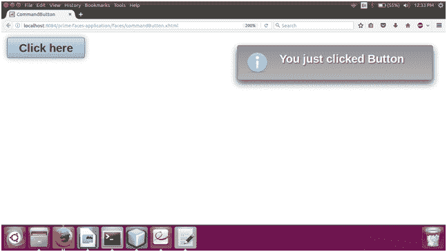

# PrimeFaces 命令按钮

> 原文:[https://www.javatpoint.com/primefaces-commandbutton](https://www.javatpoint.com/primefaces-commandbutton)

这是 JSF 标准 **h:命令按钮**的扩展版本。它包括 ajax、部分处理和皮肤功能。

在 JSF 应用程序中，使用 **< p:commandButton >** 组件来创建按钮。当我们想要在 web 应用程序中执行操作时，它非常有用。

该组件具有以下列出的各种属性。

## 命令按钮属性

| 属性 | 缺省值 | 类型 | 描述 |
| 提供 | 真实的 | 布尔代数学体系的 | 它用于指定组件的呈现。 |
| 价值 | 空 | 线 | 它用于设置按钮的标签。 |
| 行为 | 空 | 方法 xpr/String | 用于设置点击按钮时的动作。 |
| 动作监听器 | 空 | MethodExpr | 它用于设置单击按钮时要处理的 actionlistener。 |
| 类型 | 使服从 | 线 | 它设置按钮的行为。 |
| 创建交互式、快速动态网页应用的网页开发技术 | 真实的 | 布尔代数学体系的 | 它指定了提交模式。 |
| 异步ˌ非同步(asynchronous) | 错误的 | 布尔代数学体系的 | 当设置为 true 时，ajax 请求不会排队。 |
| 过程 | 空 | 线 | 它用于处理部分视图，而不是整个视图。 |
| 更新 | 空 | 线 | 它用于用 ajax 更新组件。 |
| 全球的 | 真实的 | 布尔代数学体系的 | 它定义了是否触发 ajaxStatus。 |
| 耽搁 | 空 | 线 | 它用于设置延迟值。 |
| partialSubmit | 错误的 | 布尔代数学体系的 | 它支持只属于部分处理组件的值的序列化。 |
| 超时 | Zero | 整数 | 它用于以毫秒为单位设置 ajax 请求的超时。 |

## 例子

在下面的例子中，我们实现了 **< p:commandButton >** 组件。本示例包含以下文件。

### JSF 档案

**// commandButton.xhtml**

```java

<?xml version='1.0' encoding='UTF-8' ?>
<!DOCTYPE html PUBLIC "-//W3C//DTD XHTML 1.0 Transitional//EN""http://www.w3.org/TR/xhtml1/DTD/xhtml1-transitional.dtd">
<html 
xmlns:h="http://xmlns.jcp.org/jsf/html"
xmlns:p="http://primefaces.org/ui">
<h:head>
<title>CommandButton</title>
</h:head>
<h:body>
<h:form>
<p:growl id="growl" life="3000" />
<p:commandButton value="Click here" id="ajax" update="growl" actionListener="#{commandButton.commandButtonAction}" styleClass="ui-priority-primary" />
</h:form>
</h:body>
</html>

```

### ManagedBean

**//CommandButton.java**

```java

package com.javatpoint;
import javax.faces.application.FacesMessage;
import javax.faces.bean.ManagedBean;
import javax.faces.context.FacesContext;
import javax.faces.event.ActionEvent;
@ManagedBean
public class CommandButton {
public void commandButtonAction(ActionEvent actionEvent) {
addMessage("You just clicked Button");
}
public void addMessage(String summary) {
FacesMessage message = new FacesMessage(FacesMessage.SEVERITY_INFO, summary,  null);
FacesContext.getCurrentInstance().addMessage(null, message);
}
}

```

输出:


