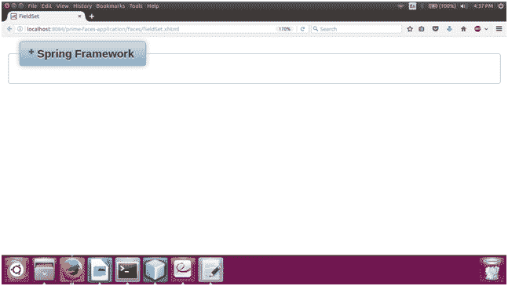

# PrimeFaces 字段集

> 原文：<https://www.javatpoint.com/primefaces-fieldset>

它是一个分组组件和 html 字段集的扩展。它是一种有传说和内容的容器。它用于显示分类数据。

PrimeFaces 提供了**T2 p:fieldset>**组件，用于在 JSF 应用程序中创建 field set。下面列出了它的各种属性。

## 字段集属性

| 属性 | 缺省值 | 类型 | 描述 |
| 神话；传奇 | 空 | 线 | 它用于设置标题文本。 |
| 风格 | 空 | 线 | 它用于设置字段集的内联 CSS。 |
| 可折叠的 | 错误的 | 布尔代数学体系的 | 它被用来使内容与动画融为一体。 |
| toggleSpeed | Five hundred | 整数 | 它用于以毫秒为单位设置切换持续时间。 |
| 崩溃 | 错误的 | 布尔代数学体系的 | 它用于定义内容的初始可见状态。 |

## 例子

在下面的例子中，我们实现了 **< p:fieldset >** 组件。本示例包含以下文件。

### JSF 档案

**// fieldset.xhtml**

```java
<?xml version='1.0' encoding='UTF-8' ?>
<!DOCTYPE html PUBLIC "-//W3C//DTD XHTML 1.0 Transitional//EN""http://www.w3.org/TR/xhtml1/DTD/xhtml1-transitional.dtd">
<html 
xmlns:h="http://xmlns.jcp.org/jsf/html"
xmlns:p="http://primefaces.org/ui">
<h:head>
<title>FieldSet</title>
</h:head>
<h:body>
<h:form>
<p:fieldset legend="Spring Framework" toggleable="true" toggleSpeed="500">
<h:panelGrid columns="2" cellpadding="5">
<p:graphicImage name="images/courses/spring.png" />
<h:outputText value="Spring is a lightweight framework. It can be thought of as a framework of frameworks 
because it provides support to various frameworks such as Struts, Hibernate, Tapestry, EJB, JSF etc. The framework, 
in broader sense, can be defined as a structure where we find solution of the various technical problems.
The Spring framework comprises several modules such as IOC, AOP, DAO, Context, ORM, WEB MVC etc. "></h:outputText>
</h:panelGrid>
</p:fieldset>
</h:form>
</h:body>
</html>

```

输出:


