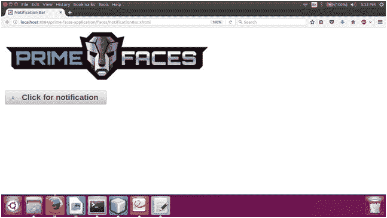

# PrimeFaces 通知栏

> 原文:[https://www.javatpoint.com/primefaces-notificationbar](https://www.javatpoint.com/primefaces-notificationbar)

这是一个多用途的固定定位面板。它用于显示通知栏。默认情况下，它显示在顶部。我们可以通过指定位置属性来设置它的位置。我们还可以设置通知栏的效果，比如:淡入淡出或滑动。除了所有这些，它还包括下面列出的各种其他属性。

## 通知栏属性

| 属性 | 缺省值 | 类型 | 描述 |
| 编号 | 空 | 线 | 它是组件的唯一标识符。 |
| 提供 | 真实的 | 布尔代数学体系的 | 它设置布尔值来指定组件的呈现。 |
| 有约束力的 | 空 | 目标 | 它是一个映射到支持 bean 中的服务器端 UIComponent 实例的表达式。 |
| 风格 | 空 | 线 | 它用于设置容器元素的样式。 |
| styleClass(样式类) | 空 | 线 | 它用于设置容器元素的 styleClass。 |
| 位置 | 顶端 | 线 | 它用于设置条的位置。 |
| 影响 | 乏味的 | 线 | 它用于设置效果的名称。 |
| 效果速度 | 标准 | 线 | 它用于设置效果的速度。 |
| 自动显示 | 错误的 | 布尔代数学体系的 | 它用于设置面板在页面加载时的显示。 |
| widgetVar | 空 | 线 | 这是客户端小部件的名称。 |

## 例子

这里，在下面的例子中，我们正在实现**<p:notification bar>**组件。本示例包含以下文件。

### JSF 档案

**// notificationBar.xhtml**

```java

<?xml version='1.0' encoding='UTF-8' ?>
<!DOCTYPE html PUBLIC "-//W3C//DTD XHTML 1.0 Transitional//EN""http://www.w3.org/TR/xhtml1/DTD/xhtml1-transitional.dtd">
<html 
xmlns:h="http://xmlns.jcp.org/jsf/html"
xmlns:p="http://primefaces.org/ui">
<h:head>
<title>Notification Bar</title>
</h:head>
<h:body>
<p:notificationBar position="top" effect="fade" styleClass="top" widgetVar="notify">
<h:outputText value="This is a Primefaces notification." style="font-size:36px;" />
</p:notificationBar>
<p:graphicImage name="images/primefaces-logo.jpeg" /><br/><br/>
<p:commandButton value="Click for notification" onclick="PF('notify').show()" type="button" icon="ui-icon-arrow-1-s"/>
</h:body>
</html>

```

输出:


