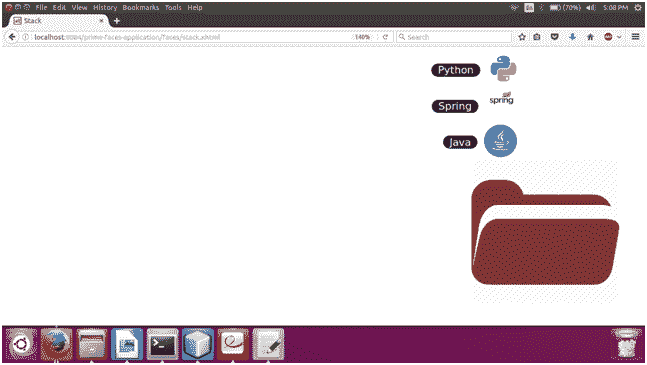

# 素数面堆栈

> 原文:[https://www.javatpoint.com/primefaces-stack](https://www.javatpoint.com/primefaces-stack)

这是一个模拟堆栈功能的导航组件。在 JSF 应用程序中， **< p:stack >** 组件用于创建的堆栈。

## 例子

这里，在下面的例子中，我们正在实现 **< p:stack >** 组件。本示例包含以下文件。

### JSF 档案

**// stack.xhtml**

```java

<?xml version='1.0' encoding='UTF-8' ?>
<!DOCTYPE html PUBLIC "-//W3C//DTD XHTML 1.0 Transitional//EN""http://www.w3.org/TR/xhtml1/DTD/xhtml1-transitional.dtd">
<html 
xmlns:h="http://xmlns.jcp.org/jsf/html"
xmlns:p="http://primefaces.org/ui">
<h:head>
<title>Stack</title>
</h:head>
<h:body>
<h:form>
<p:stack icon="/resourcimg/portfolio.png">
<p:menuitem value="Java" icon="/resourcimg/courses/java.png" />
<p:menuitem value="Spring" icon="/resourcimg/courses/spring.png" />
<p:menuitem value="Python" icon="/resourcimg/courses/python.png"/>
</p:stack>
</h:form>
</h:body>
</html>

```

输出:


当点击文件夹时，它弹出元素。

