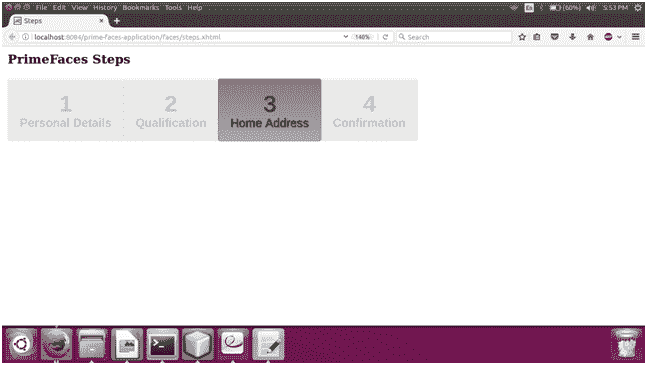
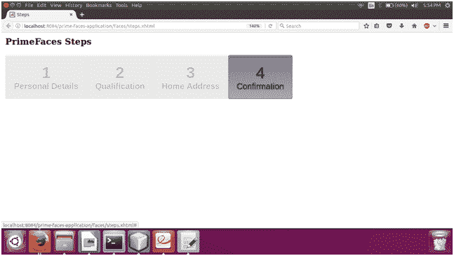

# PrimeFaces 步骤

> 原文:[https://www.javatpoint.com/primefaces-steps](https://www.javatpoint.com/primefaces-steps)

该组件是工作流中各个步骤的指示器。它表明我们现在正处于什么阶段。它用于在多步骤应用中显示当前步骤。

**< p:步骤>** 组件用于在 JSF 应用程序中创建步骤指示器。它有各种重要的属性，如下表所示。

## 步骤属性

| 属性 | 缺省值 | 类型 | 描述 |
| 编号 | 空 | 线 | 它是组件的唯一标识符。 |
| 提供 | 真实的 | 布尔代数学体系的 | 它使用布尔值来指定组件的呈现。 |
| 模型 | 空 | 功能表模型 | 用于动态构建菜单。 |
| 风格 | 空 | 线 | 它用于设置组件的内联样式。 |
| activeIndex | Zero | 整数 | 它是活动选项卡的索引。 |
| widgetVar | 空 | 线 | 它用于设置客户端小部件的名称。 |
| 只读的 | 真实的 | 布尔代数学体系的 | 它用于使组件只读。 |

## 纺纱

下面是结构样式类的表格。

| 样式类 | 适用 |
| 。用户界面步骤 | 它适用于主容器元素。 |
| 。ui-步骤-项目 | 它适用于 step 元素。 |
| 。ui-步骤-名称 | 它适用于步骤名称。 |
| 。ui-步骤-项目 | 此类用于步骤编号。 |

## 例子

这里，在下面的例子中，我们正在实现 **< p:steps >** 组件。本示例包含以下文件。

### JSF 档案

**// steps.xhtml**

```java

<?xml version='1.0' encoding='UTF-8' ?>
<!DOCTYPE html PUBLIC "-//W3C//DTD XHTML 1.0 Transitional//EN""http://www.w3.org/TR/xhtml1/DTD/xhtml1-transitional.dtd">
<html 
xmlns:h="http://xmlns.jcp.org/jsf/html"
xmlns:p="http://primefaces.org/ui">
<h:head>
<title>Steps</title>
</h:head>
<h:body>
<h3 style="margin-top:0">PrimeFaces Steps</h3>
<p:steps activeIndex="3">
<p:menuitem value="Personal Details" />
<p:menuitem value="Qualification" />
<p:menuitem value="Home Address" />
<p:menuitem value="Confirmation" />
</p:steps>
</h:body>
</html>

```

输出:



如果我们更改 activeIndex = 3，它将产生以下输出。

