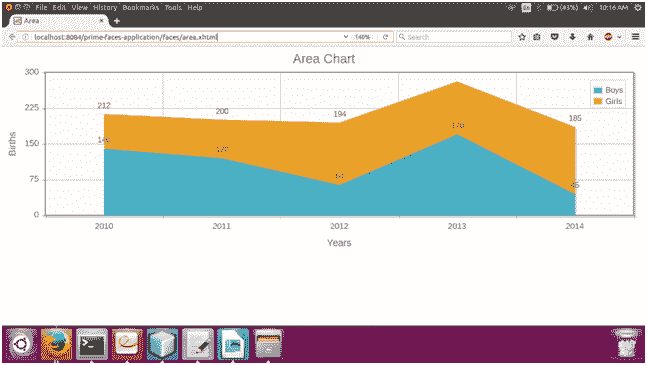

# primefaces 面积图

> 原文:[https://www.javatpoint.com/primefaces-areachart](https://www.javatpoint.com/primefaces-areachart)

这是一个定制和高级版本的折线图，其中填充了系列。它用于以图形方式表示统计数据。 **< p:图表>** 是在 JSF 应用程序中创建图表的通用组件。我们可以设置图表类型来指定图表的类型。

下表列出了该图表的各种属性。这些属性是通用的，适用于所有类型的图表。

## 图表属性

| 属性 | 缺省值 | 类型 | 描述 |
| 编号 | 空 | 线 | 它是组件的唯一标识符。 |
| 提供 | 真实的 | 布尔代数学体系的 | 它使用布尔值来指定组件的呈现。 |
| 类型 | 空 | 线 | 它用于指定图表的类型。 |
| 模型 | 空 | 图表模型 | 它用于设置模型对象的数据和设置。 |
| 风格 | 空 | 线 | 它用于设置组件的内联样式。 |
| widgetVar | 空 | 线 | 这是客户端小部件的名称。 |
| 应答的 | 错误的 | 布尔代数学体系的 | 在响应模式下，当调整窗口大小时，图表将被重绘。 |

## 例子

这里，在下面的例子中，我们正在实现 **< p:chart >** 组件。本示例包含以下文件。

### JSF 档案

**// area.xhtml**

```java

<?xml version='1.0' encoding='UTF-8' ?>
<!DOCTYPE html PUBLIC "-//W3C//DTD XHTML 1.0 Transitional//EN""http://www.w3.org/TR/xhtml1/DTD/xhtml1-transitional.dtd">
<html 
xmlns:h="http://xmlns.jcp.org/jsf/html"
xmlns:p="http://primefaces.org/ui">
<h:head>
<title>Area</title>
</h:head>
<h:body>
<p:chart type="line" model="#{area.drawArea}" style="height:300px" />
</h:body>
</html>

```

### ManagedBean

**//Area.java**

```java

package com.javatpoint;
import javax.annotation.PostConstruct;
import java.io.Serializable;
import javax.faces.bean.ManagedBean;
import org.primefaces.model.chart.Axis;
import org.primefaces.model.chart.AxisType;
import org.primefaces.model.chart.CategoryAxis;
import org.primefaces.model.chart.LineChartModel;
import org.primefaces.model.chart.LineChartSeries;
@ManagedBean
public class Area implements Serializable {
private LineChartModel drawArea;
@PostConstruct
public void init() {
createDrawArea();
}
public LineChartModel getDrawArea() {
return drawArea;
}
private void createDrawArea() {
drawArea = new LineChartModel();
LineChartSeries boys = new LineChartSeries();
boys.setFill(true);
boys.setLabel("Boys");
boys.set("2010", 140);
boys.set("2011", 120);
boys.set("2012", 64);
boys.set("2013", 170);
boys.set("2014", 45);
LineChartSeries girls = new LineChartSeries();
girls.setFill(true);
girls.setLabel("Girls");
girls.set("2010", 72);
girls.set("2011", 80);
girls.set("2012", 130);
girls.set("2013", 110);
girls.set("2014", 140);
drawArea.addSeries(boys);
drawArea.addSeries(girls);
drawArea.setTitle("Area Chart");
drawArea.setLegendPosition("ne");
drawArea.setStacked(true);
drawArea.setShowPointLabels(true);
Axis xAxis = new CategoryAxis("Years");
drawArea.getAxes().put(AxisType.X, xAxis);
Axis yAxis = drawArea.getAxis(AxisType.Y);
yAxis.setLabel("Births");
yAxis.setMin(0);
yAxis.setMax(300);
}
}

```

输出:

