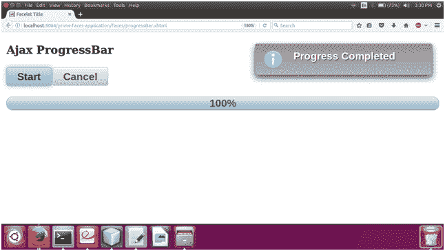

# PrimeFaces ProgressBar

> 原文:[https://www.javatpoint.com/primefaces-progressbar](https://www.javatpoint.com/primefaces-progressbar)

它是一个进程状态指示器，可以纯粹在客户端工作，也可以使用 Ajax 与服务器端交互。用于显示执行过程的状态和进度。ProgressBar 有两种模式:客户端和 Ajax。默认情况下，启用客户端模式。通过将 ajax 属性设置为 true，可以启用 Ajax 模式。

**T2 p:progressBar>**用于在 JSF 应用中创建 progress bar。下面列出了它的各种属性。

## 进度条属性

| 属性 | 缺省值 | 类型 | 描述 |
| 编号 | 空 | 线 | 它是组件的唯一标识符。 |
| 提供 | 真实的 | 布尔代数学体系的 | 它用于指定组件的呈现。 |
| widgetVar | 空 | 线 | 这是客户端小部件的名称。 |
| 价值 | Zero | 整数 | 它用于设置进度条的值。 |
| 有缺陷的 | 错误的 | 布尔代数学体系的 | 它用于禁用或启用 progressbar。 |
| 创建交互式、快速动态网页应用的网页开发技术 | 错误的 | 布尔代数学体系的 | 它指定了 progressBar 的模式。 |
| 间隔 | Three thousand | 整数 | 它用于在 ajax 模式下设置定期请求的时间间隔(以秒为单位)。 |
| 风格 | 空 | 线 | 它用于设置主容器元素的内联样式。 |
| styleClass(样式类) | 空 | 线 | 用于设置主容器元素的样式类。 |
| 标签模板 | {value} | 线 | 用于设置进度标签的模板。 |
| 仅显示 | 错误的 | 布尔代数学体系的 | 它启用静态显示模式。 |
| 全球的 | 真实的 | 布尔代数学体系的 | ajaxStatus 组件监听全局 ajax 请求。 |

## 例子

这里，在下面的例子中，我们正在实现 **< p:progressBar >** 组件。本示例包含以下文件。

### JSF 档案

//progress bar . XHTML

```java
<?xml version='1.0' encoding='UTF-8' ?>
<!DOCTYPE html PUBLIC "-//W3C//DTD XHTML 1.0 Transitional//EN""http://www.w3.org/TR/xhtml1/DTD/xhtml1-transitional.dtd">
<html 
xmlns:h="http://xmlns.jcp.org/jsf/html"
xmlns:p="http://primefaces.org/ui">
<h:head>
<title>ProgressBar</title>
</h:head>
<h:body>
<h:form>
<p:growl id="growl" />
<h3>Ajax ProgressBar Example</h3>
<p:commandButton value="Start" type="button" onclick="PF('pbAjax').start();PF('startButton2').disable();" 
widgetVar="startButton2" />
<p:commandButton value="Cancel" actionListener="#{progressBar.cancel}" 
oncomplete="PF('pbAjax').cancel();PF('startButton2').enable();" />
<br /><br />
<p:progressBar widgetVar="pbAjax" ajax="true" value="#{progressBar.progress}" 
labelTemplate="{value}%" styleClass="animated" global="false">
<p:ajax event="complete" listener="#{progressBar.onComplete}" update="growl"  
oncomplete="PF('startButton2').enable()"/>
</p:progressBar>
</h:form>
</h:body>
</html>

```

### ManagedBean

//progress bar . Java

```java
package com.javatpoint;
import javax.faces.application.FacesMessage;
import javax.faces.bean.ManagedBean;
import javax.faces.bean.ViewScoped;
import javax.faces.context.FacesContext;
@ManagedBean
@ViewScoped
public class ProgressBar {
private Integer progress;
public Integer getProgress() {
if(progress == null) {
progress = 0;
}
else {
progress = progress + (int)(Math.random() * 15);

if(progress > 100)
progress = 100;
}
return progress;
}
public void setProgress(Integer progress) {
this.progress = progress;
}
public void onComplete() {
FacesContext.getCurrentInstance().addMessage(null, new FacesMessage("Progress Completed"));
}
public void cancel() {
progress = null;
}
}

```

输出:


