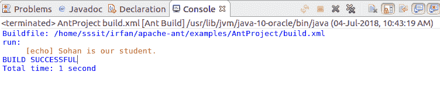

# 阿帕奇蚂蚁属性

> 原文:[https://www.javatpoint.com/apache-ant-properties](https://www.javatpoint.com/apache-ant-properties)

属性是键值对，其中每个值都与一个键相关联。属性用于设置可在构建文件中任何地方访问的值。一旦设置了属性，就不能更改它。

Apache Ant 提供 **<属性>** 标签，可以用来设置属性。

## Apache Ant 属性类型

1.  内置属性
2.  用户定义的属性

### Apache Ant 内置属性

Apache Ant 提供了各种内置属性，我们可以在构建文件中访问所有这些属性。下面给出了一些内置属性。

| 财产 | 描述 |
| 基巴 | 它用于项目的 basedir 的绝对路径。 |
| ant.file | 它用于构建文件的绝对路径。 |
| 蚂蚁。 | 版本它用于 Ant 的版本。 |
| ant.project.name | 它保存当前正在执行的项目的名称。 |
| ant.project.default-target | 它保存当前执行项目的默认目标的名称。 |
| ant . project . called-targets | 调用当前项目时的目标列表。 |
| ant.java .版本 | 它保存 JVM 版本。 |
| ant.core.lib | ant.jar 文件的绝对路径。 |
| 蚂蚁之家 | 它包含蚂蚁的主目录。 |
| ant.library.dir | 它保存着用于加载 Ant 的 jars 的目录。 |

### Apache Ant 用户定义属性

除了内置属性，Apache Ant 还提供了在构建文件中创建自定义属性的功能。

为了创建属性，提供了使用**名称**和**值**属性的 **<属性>** 标签。name 属性是属性的名称，value 属性保存一个值。

为了进一步理解，我们来看一个例子。

### Apache Ant 属性示例

**// build.xml**

```java

<project name="apache-ant project" default="run">
	<property name="student-name" value = "Sohan"></property>
	<target name="run">
		<echo>${student-name} is our student.</echo>
	</target>
	<target name="compile">
		<javac includeantruntime="false" srcdir="./src" destdir = "test"></javac>
	</target>
</project>

```

**输出:**

