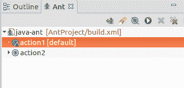

# Apache Ant IDE 集成

> 原文：<https://www.javatpoint.com/apache-ant-ide-integration>

集成开发环境是一个设计和开发软件应用程序的平台。有各种各样的现代 Java 集成开发环境，它们是流行的和广泛使用的。下面给出了一些。

*   Emacs 的 Java 开发环境
*   想法
*   开发工具
*   绝地武士
*   黯然失色
*   虚拟蚂蚁

所有的 IDEs 都支持 Apache Ant，并为编写构建文件提供了方便的环境。在这里，我们将看到如何在 Eclipse IDE 中使用 Ant。

Eclipse 是由 IBM 生产的一个开源的基于 Java 的 IDE。Apache Ant 已经安装在 Eclipse 中，可以使用了。

要在 Java 中实现 Ant，首先创建一个 Java 项目，然后创建一个 build.xml 文件。build.xml 是默认名称，尽管我们可以用其他名称创建构建文件。

我们已经创建了一个包含构建文件的 Java 项目 **AntProject** 。构建文件包含以下代码。

**// build.xml**

```java

<project name="java-ant" default="action1">
	<target name="action1">
		<echo>This is first action</echo>
	</target>
	<target name="action2">
		<echo>This is second action</echo>
	</target>
</project>

```

要运行这个文件，我们可以通过从菜单栏的窗口选项中选择 ant 来打开 Ant 窗口。蚂蚁窗口如下图所示。



在我们的构建文件中，action1 是默认的，但是我们可以通过点击 target 来运行任何目标。

除了窗口视图，Eclipse 还提供了一个 Ant 编辑器来创建、编写 build.xml 文件。

**//蚂蚁编辑器**

