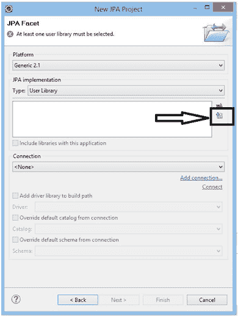
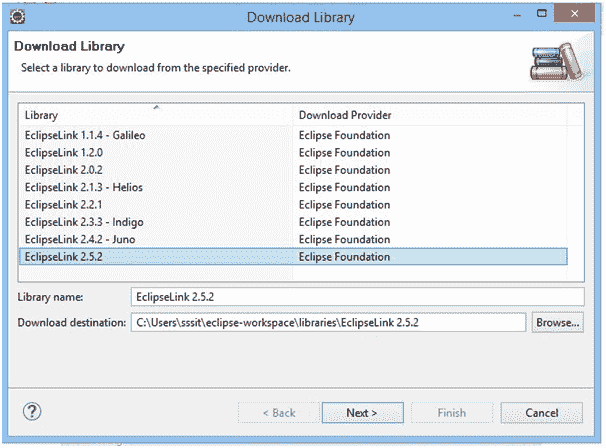
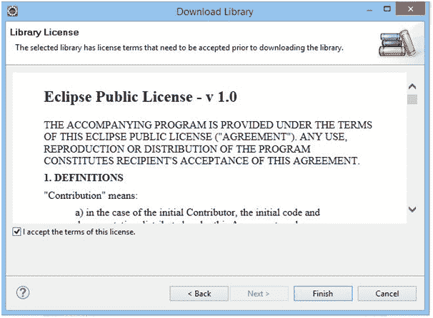

# JPA 安装

> 原文:[https://www.javatpoint.com/jpa-installation](https://www.javatpoint.com/jpa-installation)

在本节中，我们将学习如何在 eclipse 上安装 JPA。请参见以下步骤:-

*   打开 eclipse，点击文件>新建> JPA 项目。

*   指定任何特定的项目名称(这里，我们将它命名为 JPAProject)，然后单击“下一步”。

*   再次单击下一步。

*   点击下载库图标(此处，包含在黑框中)。

*   点击 EclipseLink 2.5.2，然后点击下一步。

*   单击复选框接受条款，然后单击完成。之后，所有需要的罐子将被下载。

*   现在，单击完成。

