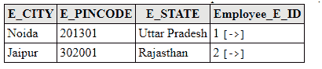

# JPA 列表映射

> 原文:[https://www.javatpoint.com/jpa-list-mapping](https://www.javatpoint.com/jpa-list-mapping)

列表是一个接口，用于在索引的基础上插入和删除元素。当需要以用户定义的顺序检索元素时，可以使用它。

## 列表映射示例

在这个例子中，我们在实体类中嵌入一个对象，并将其定义为集合类型列表。

```java

private List<Address> address=new ArrayList<Address>();

```

该示例包含以下步骤:-

*   在 com.javatpoint.jpa 包下创建一个实体类 Employee.java，其中包含员工 id、姓名和嵌入对象(员工地址)。注释@ElementCollection 表示嵌入的对象。

**Employee.java**

```java

package com.javatpoint.jpa;
import java.util.*;

import javax.persistence.*;
@Entity

public class Employee {

	@Id
	@GeneratedValue(strategy=GenerationType.AUTO)
	private int e_id;
	private String e_name;

	@ElementCollection
	private List<Address> address=new ArrayList<Address>();

	public int getE_id() {
		return e_id;
	}

	public void setE_id(int e_id) {
		this.e_id = e_id;
	}

	public String getE_name() {
		return e_name;
	}

	public void setE_name(String e_name) {
		this.e_name = e_name;
	}

	public List<Address> getAddress() {
		return address;
	}

	public void setAddress(List<Address> address) {
		this.address = address;
	}

}

```

*   现在，在 com.javatpoint.jpa 包下创建一个嵌入对象 Address.java 的类。注释@Embeddable 表示可嵌入的对象。

**Address.java**

```java

package com.javatpoint.jpa;
import javax.persistence.*;

@Embeddable
public class Address {

	private int e_pincode;
	private String e_city;
	private String e_state;
	public int getE_pincode() {
		return e_pincode;
	}
	public void setE_pincode(int e_pincode) {
		this.e_pincode = e_pincode;
	}
	public String getE_city() {
		return e_city;
	}
	public void setE_city(String e_city) {
		this.e_city = e_city;
	}
	public String getE_state() {
		return e_state;
	}
	public void setE_state(String e_state) {
		this.e_state = e_state;
	}

}

```

*   现在，在 Persistence.xml 文件中映射实体类和其他数据库配置。

**Persistence.xml**

```java

<persistence>
<persistence-unit name="Collection_Type">

	<class>com.javatpoint.jpa.Employee</class>
<class>com.javatpoint.jpa.Address</class>

<properties>
<property name="javax.persistence.jdbc.driver" value="com.mysql.jdbc.Driver"/>
<property name="javax.persistence.jdbc.url" value="jdbc:mysql://localhost:3306/collection_mapping"/>
<property name="javax.persistence.jdbc.user" value="root"/>
<property name="javax.persistence.jdbc.password" value=""/>
<property name="eclipselink.logging.level" value="SEVERE"/>
<property name="eclipselink.ddl-generation" value="create-or-extend-tables"/>
</properties>

	</persistence-unit>
</persistence>

```

*   在 com.javatpoint.collection 包下创建一个持久化类 ListMapping.java，用数据持久化实体对象。

list mapping . Java

```java

package com.javatpoint.collection;
import javax.persistence.*;

import com.javatpoint.jpa.*;
public class ListMapping{

	public static void main(String[] args) {

		EntityManagerFactory emf=Persistence.createEntityManagerFactory("Collection_Type");
		EntityManager em=emf.createEntityManager();

		em.getTransaction().begin();

		Address a1=new Address();
		a1.setE_pincode(201301);
		a1.setE_city("Noida");
		a1.setE_state("Uttar Pradesh");

		Address a2=new Address();
		a2.setE_pincode(302001);
		a2.setE_city("Jaipur");
		a2.setE_state("Rajasthan");

	Employee e1=new Employee();
	e1.setE_id(1);
	e1.setE_name("Vijay");
	e1.getAddress().add(a1);

	Employee e2=new Employee();
	e2.setE_id(2);
	e2.setE_name("John");
	e2.getAddress().add(a2);

	em.persist(e1);
	em.persist(e2);

	em.getTransaction().commit();

	em.close();
	emf.close();

	}

}

```

**输出:**

程序执行后，在 MySQL 工作台下生成下表。

*   员工表-此表包含员工详细信息。要获取数据，请在 MySQL 中运行雇员查询中的 select *。


*   雇员地址表-该表表示雇员和地址表之间的映射。要获取数据，请在 MySQL 中运行 select * from employee_address 查询。

