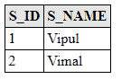

# 多对多映射

> 原文:[https://www.javatpoint.com/jpa-many-to-many-mapping](https://www.javatpoint.com/jpa-many-to-many-mapping)

多对多映射表示集合值关联，其中任意数量的实体可以与其他实体的集合相关联。在关系数据库中，一个实体的任意行数可以引用另一个实体的任意行数。

## @ManyToMany 示例

在这个例子中，我们将在学生和图书馆之间创建一个多对多的关系，这样任何数量的学生都可以获得任何类型的书籍。

该示例包含以下步骤:-

*   在包含学生标识(s_id)和学生名称(s_name)的 com.javatpoint.mapping 包下创建一个实体类 Student.java，并带有包含列表类型的库类对象的@ManyToMany 注释。

```java

import java.util.List;

import javax.persistence.*;

@Entity
public class Student {

	@Id
	@GeneratedValue(strategy=GenerationType.AUTO)
	private int s_id;
	private String s_name;

	@ManyToMany(targetEntity=Library.class)
	private List lib;

	public Student(int s_id, String s_name, List lib) {
		super();
		this.s_id = s_id;
		this.s_name = s_name;
		this.lib = lib;
	}

	public Student() {
		super();
		// TODO Auto-generated constructor stub
	}

	public List getLib() {
		return lib;
	}
	public void ListLib(List lib) {
		this.lib = lib;
	}
	public int getS_id() {
		return s_id;
	}
	public void ListS_id(int s_id) {
		this.s_id = s_id;
	}
	public String getS_name() {
		return s_name;
	}
	public void ListS_name(String s_name) {
		this.s_name = s_name;
	}
	}

```

*   在 com.javatpoint.mapping 包下创建另一个实体类 Library.java，它包含图书 id (b_id)，图书名称(b_name)，带有@ManyToMany 注释，该注释包含列表类型的学生类对象。

**Library.java**

```java

package com.javatpoint.mapping;

import java.util.List;

import javax.persistence.*;

@Entity
public class Library {
	@Id
	@GeneratedValue(strategy=GenerationType.AUTO)
private int b_id;
private String b_name;

@ManyToMany(targetEntity=Student.class)
private List stud;

public Library(int b_id, String b_name, List stud) {
	super();
	this.b_id = b_id;
	this.b_name = b_name;
	this.stud = stud;
}

public Library() {
	super();
	// TODO Auto-generated constructor stub
}

public int getB_id() {
	return b_id;
}

public void ListB_id(int b_id) {
	this.b_id = b_id;
}

public String getB_name() {
	return b_name;
}

public void ListB_name(String b_name) {
	this.b_name = b_name;
}

public List getStud() {
	return stud;
}

public void ListStud(List stud) {
	this.stud = stud;
}

}

```

*   现在，在 Persistence.xml 文件中映射实体类和其他数据库配置。

**Persistence.xml**

```java

<persistence>

<persistence-unit name="books_issued">

      <class>com.javatpoint.mapping.Student</class>
      <class>com.javatpoint.mapping.Library</class>

     <properties>
      <property name="javax.persistence.jdbc.driver" value="com.mysql.jdbc.Driver"/>
         <property name="javax.persistence.jdbc.url" value="jdbc:mysql://localhost:3306/mapping_db"/>
         <property name="javax.persistence.jdbc.user" value="root"/>
         <property name="javax.persistence.jdbc.password" value=""/>
         <property name="eclipselink.logging.level" value="SEVERE"/>
         <property name="eclipselink.ddl-generation" value="create-or-extend-tables"/>
      </properties>

	</persistence-unit>
</persistence>

```

*   在 com.javatpoint.ManyToOne 包下创建一个持久性类 ManyToOneExample，用数据持久化实体对象。

```java

package com.javatpoint.mapping.ManyToMany;
import java.util.ArrayList;

import javax.persistence.*;
import com.javatpoint.mapping.Student;
import com.javatpoint.mapping.Library;

public class ManyToManyExample {

	public static void main(String[] args) {

		EntityManagerFactory emf=Persistence.createEntityManagerFactory("books_issued");
		EntityManager em=emf.createEntityManager();

		em.getTransaction().begin();

		Student st1=new Student(1,"Vipul",null);
		Student st2=new Student(2,"Vimal",null);

		em.persist(st1);
		em.persist(st2);

		ArrayList al1=new ArrayList<student>();
	ArrayList <student>al2=new ArrayList<student>();

		al1.add(st1);
		al1.add(st2);

		al2.add(st1);
		al2.add(st2);

		Library lib1=new Library(101,"Data Structure",al1);
		Library lib2=new Library(102,"DBMS",al2);

		em.persist(lib1);
		em.persist(lib2);

		em.getTransaction().commit();
		em.close();
		emf.close();

	}

}</student></student></student> 
```

**输出:**

程序执行后，在 MySQL 工作台下生成三个表。

*   学生表-该表包含学生详细信息。要获取数据，在 MySQL 中运行**从学生**中选择*查询。



*   库表-该表包含库的详细信息。要获取数据，在 MySQL 中运行**从库**中选择*查询。


*   Library_student -此表包含库的详细信息。要获取数据，在 MySQL 中运行**从 library_student** 中选择*查询。

**