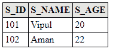

# JPA 级联持续

> 原文:[https://www.javatpoint.com/jpa-cascade-persist](https://www.javatpoint.com/jpa-cascade-persist)

级联持久化用于指定如果一个实体被持久化，那么它的所有相关子实体也将被持久化。以下语法用于执行级联持久操作:-

```java

@OneToOne(cascade=CascadeType.PERSIST)

```

## JPA 级联持久化示例

在这个例子中，我们将创建两个相互关联的实体类，但是为了建立它们之间的依赖关系，我们将执行级联操作。

该示例包含以下步骤:-

*   在 com.javatpoint.jpa.student 包下创建一个名为 StudentEntity.java 的实体类，该类包含属性 s_id、s_name、s_age 和一个标有级联规范的 Subject 类型的对象。

**学生学位。java**

```java

import javax.persistence.*;
import com.javatpoint.jpa.subject.Subject;

@Entity
@Table(name="student")
public class StudentEntity {

	@Id
	private int s_id;
	private String s_name;
	private int s_age;

	@OneToOne(cascade=CascadeType.PERSIST)
	private Subject sub;

	public Subject getSub() {
		return sub;
	}

	public void setSub(Subject sub) {
		this.sub = sub;
	}

	public StudentEntity(int s_id, String s_name, int s_age , Subject sub) {
		super();
		this.s_id = s_id;
		this.s_name = s_name;
		this.s_age = s_age;
		this.sub=sub;
	}

	public StudentEntity() {
		super();
	}

	public int getS_id() {
		return s_id;
	}

	public void setS_id(int s_id) {
		this.s_id = s_id;
	}

	public String getS_name() {
		return s_name;
	}

	public void setS_name(String s_name) {
		this.s_name = s_name;
	}

	public int getS_age() {
		return s_age;
	}

	public void setS_age(int s_age) {
		this.s_age = s_age;
	}

}

```

*   在 com.javatpoint.jpa.subject 包下创建另一个名为 Subject.java 的实体类。

**Subject.java**

```java

package com.javatpoint.jpa.subject;
import javax.persistence.*;

@Entity
@Table(name="subject")
public class Subject {

	private String name;
	private int marks;
      @Id
	private int s_id;
	public Subject(String name, int marks, int s_id) {
		super();
		this.name = name;
		this.marks = marks;
            this.s_id=s_id;
	}

	public Subject()
	{
		super();
	}
	public String getName() {
		return name;
	}
	public void setName(String name) {
		this.name = name;
	}
	public int getMarks() {
		return marks;
	}
	public void setMarks(int marks) {
		this.marks = marks;
	}

public int getS_id() {
		return s_id;
	}

	public void setS_id(int s_id) {
		this.s_id = s_id;
	}

}

```

*   现在，在 Persistence.xml 文件中映射实体类和其他数据库配置。

**Persistence.xml**

```java

<persistence>
<persistence-unit name="Student_details">

	<class>com.javatpoint.jpa.student.StudentEntity</class>
    <class>com.javatpoint.jpa.subject.Subject</class>
      <properties>
         <property name="javax.persistence.jdbc.url" value="jdbc:mysql://localhost:3306/studentdata"/>
         <property name="javax.persistence.jdbc.user" value="root"/>
         <property name="javax.persistence.jdbc.password" value=""/>
         <property name="javax.persistence.jdbc.driver" value="com.mysql.jdbc.Driver"/>
         <property name="eclipselink.logging.level" value="SEVERE"/>
         <property name="eclipselink.ddl-generation" value="create-or-extend-tables"/>
      </properties>

	</persistence-unit>
</persistence>

```

*   在 com.javatpoint.jpa.cascade 包下创建一个名为 StudentCascade.java 的持久性类，用数据持久化实体对象。

**学生瀑布. java**

```java

package com.javatpoint.jpa.cascade;
import javax.persistence.*;

import com.javatpoint.jpa.student.*;
import com.javatpoint.jpa.subject.Subject;
public class StudentCascade {

	 public static void main( String[ ] args ) {

	      EntityManagerFactory emf = Persistence.createEntityManagerFactory( "Student_details" );

	      EntityManager em = emf.createEntityManager( );
	    em.getTransaction().begin();

	      StudentEntity s1=new StudentEntity();
	      s1.setS_id(101);
	      s1.setS_name("Vipul");
	      s1.setS_age(20);

	      StudentEntity s2=new StudentEntity();
	      s2.setS_id(102);
	      s2.setS_name("Aman");
	      s2.setS_age(22);

	      Subject sb1=new Subject();
	      sb1.setName("ENGLISH");
	      sb1.setMarks(80);
            sb1.setS_id(s1.getS_id());

            Subject sb2=new Subject();
  	      sb2.setName("Maths");
  	      sb2.setMarks(75);
              sb2.setS_id(s2.getS_id());

	      s1.setSub(sb1);
	      s2.setSub(sb2);

	      em.persist( s1 );//No need to perform persist operation separately for different entities.
	      em.persist(s2);

	      em.getTransaction().commit();

	      em.close( );
	      emf.close( );

	}

}

```

#### 注意-学生表中的主键，即 s_id，将被视为主题表中的外键，以维护两个表之间的关系。

**输出:**

程序执行后，在 MySQL 工作台下生成了以下表格。

*   学生表-要获取数据，运行**从 MySQL 中的学生**中选择*。



*   主题表-要获取数据，运行**从 MySQL 中的主题**中选择*。

