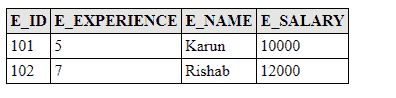

# 每类表格策略

> 原文：<https://www.javatpoint.com/jpa-table-per-class-strategy>

在每类表策略中，为每个子实体类生成一个单独的表。与连接策略不同，在每类表策略中，不会为父实体类生成单独的表。

以下语法表示每类表策略:-

```java

@Inheritance(strategy=InheritanceType.TABLE_PER_CLASS)

```

## 每类表格示例

在本例中，我们将员工分为在职员工和退休员工。

因此，活动员工和退休员工子类继承了父类员工的 e_id 和 e_name 字段。

现在，按照以下步骤创建 JPA 项目，

*   在 com . javatpoint . JPA . inheritance 包下创建一个根实体类 Employee.java，并指定所有必需的变量和注释。

**Employee.java**

```java

package com.javatpoint.jpa.inheritence;

import java.io.Serializable;

import javax.persistence.*;

@Entity
@Table(name="employee_details")
@Inheritance(strategy=InheritanceType.TABLE_PER_CLASS)
public class Employee implements Serializable {

@Id	
private int e_id;
private String e_name;

public Employee(int e_id, String e_name) {
	super();
	this.e_id = e_id;
	this.e_name = e_name;
}

public Employee() {
	super();

}

public int getE_id() {
	return e_id;
}

public void setE_id(int e_id) {
	this.e_id = e_id;
}

public String getE_name() {
	return e_name;
}

public void setE_name(String e_name) {
	this.e_name = e_name;
}

}

```

*   在 com . javatpoint . JPA . inheritance 包下创建一个实体类 ActiveEmployee.java(Employee.java 的子类)。

**ActiveEmployee.java**

```java

package com.javatpoint.jpa.inheritence;
import javax.persistence.*;

@Entity
public class ActiveEmployee extends Employee {

	private int e_salary;
	private int e_experience;
	public ActiveEmployee(int e_id, String e_name, int e_salary, int e_experience) {
		super(e_id, e_name);
		this.e_salary = e_salary;
		this.e_experience = e_experience;
	}
	public ActiveEmployee() {
		super();

	}
	public int getE_salary() {
		return e_salary;
	}
	public void setE_salary(int e_salary) {
		this.e_salary = e_salary;
	}
	public int getE_experience() {
		return e_experience;
	}
	public void setE_experience(int e_experience) {
		this.e_experience = e_experience;
	}

}

```

*   在 com . javatpoint . JPA . inheritance 包下创建另一个实体类 RetiredEmployee.java(Employee.java 的子类)。

**RetiredEmployee.java**

```java

package com.javatpoint.jpa.inheritence;

import javax.persistence.*;
@Entity
public class RetiredEmployee extends Employee {

	private int e_pension;

	public RetiredEmployee(int e_id, String e_name, int e_pension) {
		super(e_id, e_name);
		this.e_pension = e_pension;
	}

	public RetiredEmployee() {
		super();

	}

	public int getE_pension() {
		return e_pension;
	}

	public void setE_pension(int e_pension) {
		this.e_pension = e_pension;
	}

}

```

*   现在，在 Persistence.xml 文件中映射实体类和其他数据库配置。

**Persistence.xml**

```java

<persistence>
<persistence-unit name="Employee_details">

      <class>com.javatpoint.jpa.inheritence.ActiveEmployee</class>
      <class>com.javatpoint.jpa.inheritence.RetiredEmployee</class>
      <class>com.javatpoint.jpa.inheritence.Employee</class>

     <properties>
      <property name="javax.persistence.jdbc.driver" value="com.mysql.jdbc.Driver"/>
         <property name="javax.persistence.jdbc.url" value="jdbc:mysql://localhost:3306/employee"/>
         <property name="javax.persistence.jdbc.user" value="root"/>
         <property name="javax.persistence.jdbc.password" value=""/>
         <property name="eclipselink.logging.level" value="SEVERE"/>
         <property name="eclipselink.ddl-generation" value="create-or-extend-tables"/>
      </properties>
      </persistence-unit>
      </persistence>

```

*   在 com.javatpoint.jpa.persistence 包下创建一个持久性类 EmployeePersistence.java。这个类用于初始化一个对象并保持它。

**EmployeePersistence.java**

```java

package com.javatpoint.jpa.persistence;

import javax.persistence.*;
import com.javatpoint.jpa.inheritence.*;

public class EmployeePersistence {

	public static void main(String[] args) {

	EntityManagerFactory emf=Persistence.createEntityManagerFactory("Employee_details");
	EntityManager em=emf.createEntityManager();

	em.getTransaction().begin();

ActiveEmployee ae1=new ActiveEmployee(101,"Karun",10000,5);
ActiveEmployee ae2=new ActiveEmployee(102,"Rishab",12000,7);

RetiredEmployee re1=new RetiredEmployee(103,"Ramesh",5000);
RetiredEmployee re2=new RetiredEmployee(104,"Raj",4000);

	em.persist(ae1);
	em.persist(ae2);

	em.persist(re1);
	em.persist(re2);

	em.getTransaction().commit();

	em.close();
	emf.close();

}}

```

**输出:**

程序执行后，在 MySQL 工作台生成两个表。

现在，分别从每个表中获取数据以生成输出。

*   从有效员工中选择*



*   从退休员工中选择*

