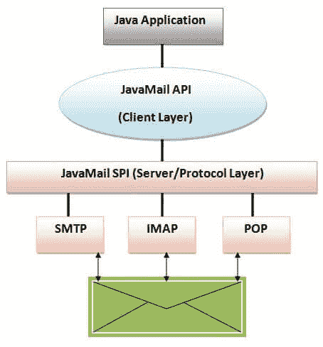

# JavaMail 教程

> 原文：<https://www.javatpoint.com/java-mail-api-tutorial>

1.  Java 邮件 API
2.  [JavaMail API 中使用的协议](#mailprotocols)
3.  SMTP
4.  [流行](#mailpop)
5.  IMAP
6.  mime
7.  [NNTP 等人](#mailnntp)

1.  [Java 邮件架构](#mailarch)
2.  [Java 邮件 API 核心类](#mailclasses)

**JavaMail** 是一个用于编写、写入和读取电子消息(电子邮件)的应用编程接口。

JavaMail API 为发送和接收邮件提供了独立于协议和平台的框架。

**javax.mail** 和 **javax.mail.activation** 包包含了 JavaMail API 的核心类。

JavaMail 工具可以应用于许多事件。它可以在注册用户时使用(发送通知，如感谢您对我的网站的兴趣)，忘记密码(发送密码给用户的电子邮件 id)，发送重要更新的通知等。所以 java 邮件 api 可以有多种用法。

<fieldset><legend class="legendfont">Do You Know ?</legend>

| 

*   How to use JavaMail API to send and receive mail?
*   How to send mail through gmail server?
*   How to send and receive emails with attachments?
*   How to send an email containing html content of an image?
*   How to forward and delete mail?

 |

</fieldset>

### JavaMail API 中使用的协议

| JavaMail API 中使用了一些协议。

*   简单邮件传输协议
*   持久性有机污染物
*   因特网邮件访问协议
*   哑剧
*   NNTP et al

 |

### 简单邮件传输协议

SMTP 是简单邮件传输协议的缩写。它提供了一种发送电子邮件的机制。我们可以使用 Apache James 服务器、Postcast 服务器、cmail 服务器等。作为一个 SMTP 服务器。但是如果我们购买主机空间，默认情况下，SMTP 服务器由主机提供商提供。例如，我的 smtp 服务器是 mail.javatpoint.com。如果我们使用主机提供商提供的 SMTP 服务器，发送和接收电子邮件需要身份验证。

### 持久性有机污染物

POP 是邮局协议的缩写，也称为 POP3。它提供了接收电子邮件的机制。它为每个用户提供单个邮箱支持。我们可以使用 Apache 詹姆斯服务器、cmail 服务器等。作为一个 POP 服务器。但是如果我们购买主机空间，默认情况下，POP 服务器由主机提供商提供。例如，主机提供商为我的站点提供的 pop 服务器是 mail.javatpoint.com。该协议在 RFC 1939 中定义。

### 因特网邮件访问协议

IMAP 是互联网消息访问协议的缩写。IMAP 是一种用于接收消息的高级协议。它为每个用户提供多个邮箱支持，此外，邮箱可以由多个用户共享。它在 RFC 2060 中定义。

### 哑剧

| 多重互联网邮件扩展(MIME)告诉浏览器正在发送什么，例如附件，消息的格式等。它不被称为邮件传输协议，但被您的邮件程序使用。 |

### NNTP 和其他

第三方提供商提供了许多协议。其中一些是网络新闻传输协议(NNTP)，安全多用途互联网邮件扩展(S/MIME)等。

* * *

### JavaMail 架构

java 应用程序使用 JavaMail API 来编写、发送和接收电子邮件。javaMail 应用编程接口使用 SPI(服务提供者接口)，为 Java 应用程序提供中间服务来处理不同的协议。让我们用下图来理解它:

* * *

### 核心类

Java Mail API 中使用了两个包:javax.mail 和 javax.mail.internet 包。这些包包含许多 Java 邮件应用编程接口类。它们是:

*   会话类
*   消息类
*   javax . mail . internet . mime message class
*   地址类
*   javax . mail . internet . INternet address 类
*   javax.mail.Authenticator 类
*   javax . mail . password authentication 类
*   javax.mail.Transport 类
*   javax.mail.Store 类
*   javax.mail.Folder 类等。

当它被使用时，我们将一个一个地了解这些类。