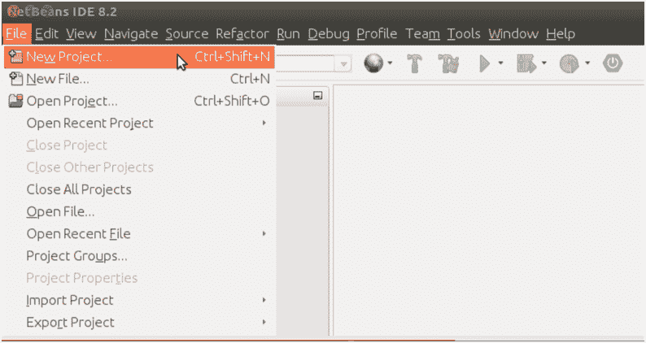
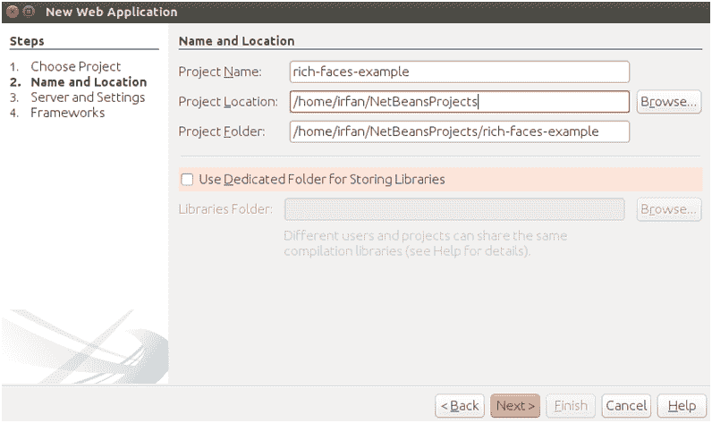
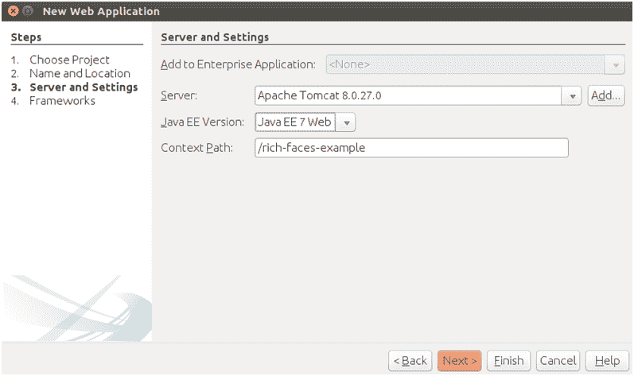
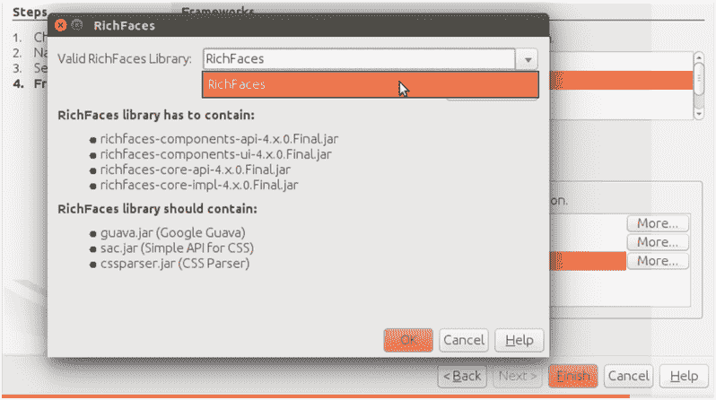
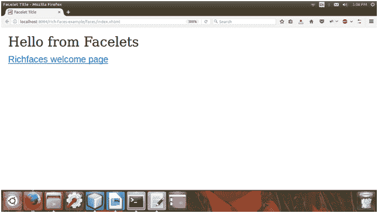

# RichFaces 应用程序

> 原文:[https://www.javatpoint.com/richfaces-application](https://www.javatpoint.com/richfaces-application)

1)添加 JARs 后，创建一个 JavaServer Faces 项目，并将这个库集成到项目中。



选择项目类型作为网络应用程序。


提供项目名称。

  

选择框架作为服务器面。

2)现在选择我们之前在示例中创建的库。



完成后，我们的项目结构应该如下所示。


嗯，这都是关于配置。我们实际上不需要做什么来配置 RichFaces。如果我们在生成的项目中查看 web.xml 文件，我们将看不到对 RichFaces 过滤器的提及。从 RichFaces 4 开始，我们不需要在 web.xml 中注册过滤器？乐。如果项目中存在 RichFaces JARs，将使用 RichFaces。

这个项目包含两个默认的 xhtml 文件。第一个是 index.xhtml，第二个是 welcomeRichfaces.xhtml，这两个文件的代码如下。

**// index.xhtml**

```java
<?xml version='1.0' encoding='UTF-8' ?>
<!DOCTYPE html PUBLIC "-//W3C//DTD XHTML 1.0 Transitional//EN""http://www.w3.org/TR/xhtml1/DTD/xhtml1-transitional.dtd">
<html 
xmlns:h="http://xmlns.jcp.org/jsf/html">
<h:head>
<title>Facelet Title</title>
</h:head>
<h:body>
Hello from Facelets
<br />
<h:link outcome="welcomeRichfaces" value="Richfaces welcome page" />
</h:body>
</html>

```

**// welcomeRichfaces.xhtml**

```java
<?xml version='1.0' encoding='UTF-8' ?>
<!DOCTYPE html PUBLIC "-//W3C//DTD XHTML 1.0 Transitional//EN""http://www.w3.org/TR/xhtml1/DTD/xhtml1-transitional.dtd">
<html 
xmlns:rich="http://richfaces.org/rich"
xmlns:h="http://java.sun.com/jsf/html">
<h:head>
<title>Richfaces Welcome Page</title>
</h:head>
<h:body>
<rich:panel header="Welcome to Richfaces">
RichFaces is an advanced UI component framework for easily integrating Ajax capabilities into business 
applications using JSF.  Check out the links below to lear more about using RichFaces in your application.
<ul>
<li><h:outputLink value="http://richfaces.org">Richfaces Project Home Page
</h:outputLink></li>
<li><h:outputLink value="http://showcase.richfaces.org">Richfaces Showcase
</h:outputLink></li>
<li><h:outputLink value="https://community.jboss.org/en/richfaces?view=discussions">User Forum
</h:outputLink></li>
<li><h:outputLink value="http://www.jboss.org/richfaces/docs">Richfaces documentation...
</h:outputLink>
<ul>
<li><h:outputLink 
value="http://docs.jboss.org/richfaces/latest_4_X/Developer_Guide/en-US/html_single/">Development Guide
</h:outputLink></li>
<li><h:outputLink 
value="http://docs.jboss.org/richfaces/latest_4_X/Component_Reference/en-US/html/">Component Reference
</h:outputLink></li>
<li><h:outputLink value="http://docs.jboss.org/richfaces/latest_4_X/vdldoc/">Tag Library Docs
</h:outputLink></li>
</ul>
</li>
</ul>
</rich:panel>
</h:body>
</html>

```

3)运行项目


运行 index.xhtml 文件后。它产生以下输出:



点击链接后，它重定向到 welcomeRichfaces 页面。


* * *