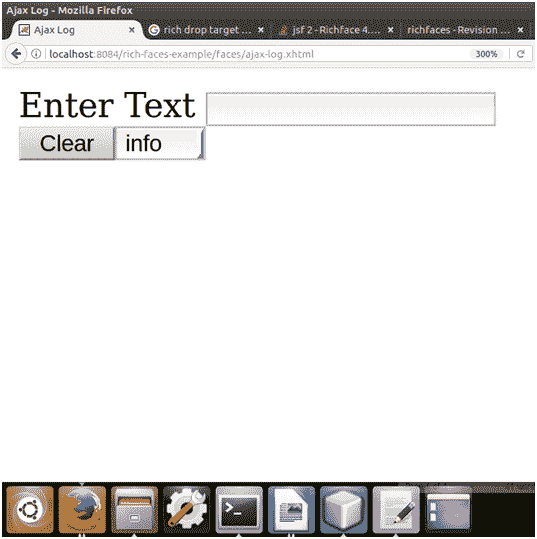
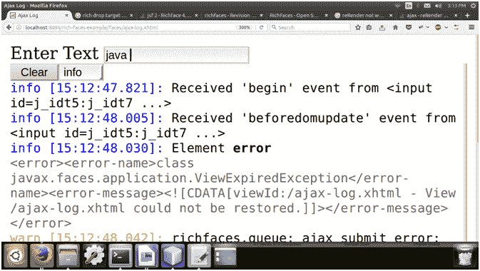

# richfaces〔t0〕

> 原文:[https://www.javatpoint.com/richfaces-a4j-log](https://www.javatpoint.com/richfaces-a4j-log)

< **a4j:log** >组件生成 JavaScript，打开调试窗口，记录应用程序信息，如请求、响应和 DOM 更改。

基本功能不需要任何附加属性。

下表包含了< **a4j:log** >的样式类和相应的皮肤参数。

| 班级 | 功能 | 皮肤参数 | 映射的 CSS 属性 |
| 。射频测井 | 它用于定义日志的样式。 | 常规文本颜色 | 颜色 |
| 。RF-日志-弹出菜单 | 当日志显示为弹出窗口时，它用于定义日志的样式。 | 没有皮肤参数。 |  |
| .rf-log-popup-cnt | 它用于定义日志弹出窗口内容的样式。 | 没有皮肤参数。 |  |
| 。rf-log-inline | 它用于定义在线显示的日志的样式。 | 没有皮肤参数。 |  |
| 。射频日志内容 | 它用于定义日志内容的样式。 | 没有皮肤参数。 |  |
| 。RF-日志条目-lbl | 它用于定义日志中标签的样式。 | 没有皮肤参数。 |  |
| 。RF-日志-条目-LBL-调试 | 它用于定义日志中调试标签的样式。 | 没有皮肤参数。 |  |
| 。RF-日志-条目-LBL-信息 | 它用于定义日志中信息标签的样式。 | 没有皮肤参数。 |  |
| 。RF-日志-条目-LBL-警告 | 它用于定义日志中警告标签的样式。 | 没有皮肤参数。 |  |
| 。RF-日志条目-LBL-错误 | 它用于为日志中的错误标签定义样式。 | 没有皮肤参数。 |  |
| 。射频日志条目消息 | 它用于为日志中的消息定义样式。 | 没有皮肤参数。 |  |
| 。RF-日志-条目-消息-调试 | 它用于定义日志中调试消息的样式。 | 没有皮肤参数。 |  |
| 。RF-日志-条目-消息-警告 | 它用于定义日志中警告消息的样式。 | 没有皮肤参数。 |  |
| 。RF-日志-条目-消息-错误 | 它用于为日志中的错误消息定义样式。 | 没有皮肤参数。 |  |
| 。RF-日志-条目-消息-xml | 它用于为日志中的 XML 消息定义样式。 | 没有皮肤参数。 |  |

* * *

### 例子

在下面的例子中，我们实现了< **a4j:log** >组件。本示例包含以下文件。

### JSF 档案

**// ajax-log.xhtml**

```java

<html 
xmlns:h="http://xmlns.jcp.org/jsf/html"
xmlns:a4j="http://richfaces.org/a4j">
<h:head>
<title>Ajax Log</title>
</h:head>
<h:body>
<h:form>
<h:outputText value="Enter Text "></h:outputText>
<h:inputText value="#{user.name}">
<a4j:ajax event="keyup" render="user-name"></a4j:ajax>
</h:inputText>
<h:outputText id="user-name" value=" #{user.name}"></h:outputText>
<a4j:log></a4j:log>
</h:form>
</h:body>
</html>

```

### 托管 Bean

**//User.java**

```java

import javax.faces.bean.ManagedBean;
import javax.faces.bean.RequestScoped;
@ManagedBean
@RequestScoped
public class User {
String name;
public String getName() {
return name;
}
public void setName(String name) {
this.name = name;
}
}

```

输出:



当我们在文本框中输入文本时，它会显示日志信息。



* * *