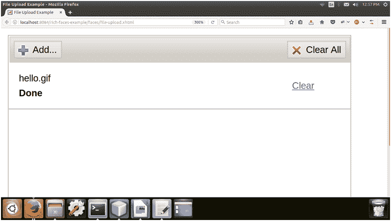

# richfaces〔t0〕

> 原文:[https://www.javatpoint.com/richfaces-rich-fileupload](https://www.javatpoint.com/richfaces-rich-fileupload)

它用于将文件上传到服务器。它提供了许多我们可以在应用程序中使用的属性。

它有很多功能，包括多次上传，进度条，对文件类型的限制和对上传文件大小的限制。

## 样式类和外观参数

下表包含样式类和相应的外观参数。

| 类别(选择器) | 功能 | 皮肤参数 | 映射的 CSS 属性 |
| . rf-fu | 它用于定义文件上传控件的样式。 | general background color panel bordercolor | 背景色边框颜色 |
| . RF-fu HDR | 它用于为文件上传控件的标题定义样式。 | headerBackgroundColor | 背景色、边框色 |
| 。RF-fu lst(射频-fu-lst) | 它用于定义文件上传控件中列表的样式。 | 没有皮肤参数。 |  |
| . RF-fu-CNT-hdn | 它用于定义文件上传容器隐藏时的样式。 | 没有皮肤参数。 |  |
| 。rf-fu-btns 的一半。rf-fu-btns-rgh 型坦克 | 它用于定义文件上传控件左侧和右侧按钮的样式。 | 没有皮肤参数。 |  |
| .rf-fu-btn-add | 它用于定义文件上传控件中“添加”按钮的样式。 | 装饰颜色面板边框颜色 | 背景色边框颜色 |
| . rf-fu-btn-cnt 加载项 | 它用于定义文件上传控件中“添加”按钮内容的样式。 | 常规文本颜色常规家族字体常规大小字体 | 彩色字体系列字体大小 |
| 。rf-fu-btn 增益集 | 当文件上传控件中的“添加”按钮被禁用时，它用于定义该按钮的样式。 | tableFooterBackgroundColor | 背景色边框颜色 |
| 。rf-fu-btn-cnt 加载项 | 当文件上传控件中的“添加”按钮被禁用时，它用于定义其内容的样式。 | tab disabletextcolor general familyfont generalizefont | 彩色字体系列字体大小 |
| rf-fu-btn 上行链路 | 它用于定义文件上传控件中上传按钮的样式。 | 装饰颜色面板边框颜色 | 背景色边框颜色 |
| . rf-fu-btn-cnt-upl | 它用于定义文件上传控件中上传按钮内容的样式。 | 常规文本颜色常规家族字体常规大小字体 | 彩色字体系列字体大小 |
| 。rf-fu-btn-clr 函数 | 它用于定义文件上传控件中“清除”按钮的样式。 | 装饰颜色面板边框颜色 | 背景色边框颜色 |
| 。rf-fu-btn-cnt-clr 函数 | 它用于定义文件上传控件中“清除”按钮内容的样式。 | 常规文本颜色常规家族字体常规大小字体 | 彩色字体系列字体大小 |
| . rf-fu-itm | 它用于为文件上传控件中的项目定义样式。 | panelBorderColor | 边框-底部颜色 |
| . rf-fu-itm-lft、. rf-fu-itm-rgh | 这些类用于定义文件上传控件左侧和右侧项目的样式。 | 没有皮肤参数。 |  |
| 。RF-fu-ITM LBL | 它用于定义文件上载控件中项目标签的样式。 | 常规文本颜色常规家族字体常规大小字体 | 彩色字体系列字体大小 |
| . rf-fu-itm-st | 它用于定义文件上传控件中项目状态的样式。 | 常规文本颜色常规家族字体常规大小字体 | 彩色字体系列字体大小 |
| . rf-fu-itm-lnk 文件 | 它用于定义文件上传控件中链接项的样式。 | 常规链接颜色常规家族字体常规大小字体 | 彩色字体系列字体大小 |
| . rf-fu-inp | 它用于定义文件上传控件中输入字段的样式。 | 没有皮肤参数。 |  |
| . RF-fu-InP-CNT | 它用于为文件上载控件中的输入字段容器定义样式。 | 没有皮肤参数。 |  |

* * *

## 例子

这里，在下面的例子中，我们实现了< **rich:fileUpload** >组件。本示例包含以下文件。

### JSF 档案

**//文件-上传. xhtml**

```java

<ui:composition  xmlns:h="http://java.sun.com/jsf/html"
xmlns:f="http://java.sun.com/jsf/core" xmlns:ui="http://java.sun.com/jsf/facelets" xmlns:a4j="http://richfaces.org/a4j"
xmlns:rich="http://richfaces.org/rich">
<f:view>
<h:head>
<title>File Upload Example</title>
</h:head>
<h:body>
<h:form>
<rich:fileUpload uploadLabel="Upload file"
acceptedTypes="jpg,jpeg,gif"
data="#{uploadFile.fileName}"
maxFilesQuantity="2"
immediateUpload="true"
maxFileSize="10000">
</rich:fileUpload>
</h:form>
</h:body>
</f:view>
</ui:composition>

```

### 托管 Bean

**// 上传文件.java**

```java

import javax.faces.bean.ManagedBean;
import javax.faces.bean.RequestScoped;
@ManagedBean
@RequestScoped
public class UploadFile {
String fileName;
public String getFileName() {
return fileName;
}
public void setFileName(String fileName) {
this.fileName = fileName;
}
}

```

输出:


点击添加图标上传文件。


选择文件并单击确定。


选择后，显示上传文件的状态。



* * *