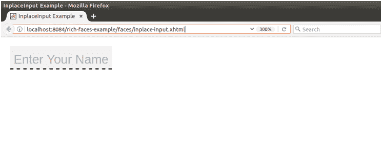

# RichFaces InplaceInput

> 原文：<https://www.javatpoint.com/richfaces-rich-inplaceinput>

RichFaces 提供了< **rich:inplaceInput** >组件，用于创建一个可编辑的文本框。它允许以文本块的形式输入文本。它提高了文本的可读性。

它有三种功能状态:

*   **查看状态:**在该状态下，组件显示其初始设置，如点击编辑。
*   **编辑状态:**在该状态下，用户可以输入文本。
*   **更改状态:**在此状态下，组件的新值已经确认，但如果需要，可以再次编辑。

## 样式类和外观参数

下表包含位置输入的样式类和相应的外观参数。

| 班级 | 功能 | 皮肤参数 | 映射的 CSS 属性 |
| . rf-ii 型 | 当就地输入处于默认状态时，它用于定义就地输入的样式。 | editorBackgroundColor | 背景色 |
| 。rf-ii-act | 它用于为处于编辑状态的就地输入定义样式。 | 没有皮肤参数。 |  |
| 。RF-ii chng 战斗机 | 当就地输入处于更改状态时，它用于定义就地输入的样式。 | 没有皮肤参数。 |  |
| 。射频 ii-dis | 当就地输入处于禁用状态时，它用于定义就地输入的样式。 | 没有皮肤参数。 |  |
| 。rf-ii-fld | 它用于定义就地输入字段的样式。 | 编辑背景颜色常规文本颜色 | 背景色、边框底色 |
| 。射频 ii LBL | 它用于为在位输入的标签定义样式。 | 一般大小字体 | 字体大小 |
| 。射频-ii dflt LBL | 它用于为在位输入的默认标签定义样式。 | 没有皮肤参数。 |  |
| 。RF-ii BTN 战斗机 | 它用于为就地输入的按钮定义样式。 | tabBackgroundColor | 背景色 |
| 。射频-ii BTN-p |  | tabBackgroundColor | 背景色 |
| 。RF-ii BTN 集。RF-ii BTN 预备队。RF-ii BTN 位置 | 它用于定义按钮的位置。 | 没有皮肤参数。 |  |
| 。RF-ii BTN-shdw 飞弹 | 它用于为就地输入的按钮阴影定义样式。 | 没有皮肤参数。 |  |
| 。射频-ii BTN-shdw-t 射频-ii BTN-shdw-b 射频-ii BTN-shdw-l 射频-ii BTN-shdw-r | 这些类定义了按钮阴影的顶部、底部、左侧和右侧边缘。 | 没有皮肤参数。 |  |
| 。RF-ii-无 | 它用于定义无法编辑的就地输入的样式。 |  | 没有皮肤参数。 |

* * *

## 例子

在下面的例子中，我们实现了< **rich:inplaceInput** >组件。本示例包含以下文件。

### JSF 档案

**// inplace-input.xhtml**

```java

<?xml version='1.0' encoding='UTF-8' ?>
<!DOCTYPE html PUBLIC "-//W3C//DTD XHTML 1.0 Transitional//EN""http://www.w3.org/TR/xhtml1/DTD/xhtml1-transitional.dtd">
<ui:composition 
xmlns:h="http://java.sun.com/jsf/html"
xmlns:f="http://java.sun.com/jsf/core"
xmlns:ui="http://java.sun.com/jsf/facelets"
xmlns:a4j="http://richfaces.org/a4j"
xmlns:rich="http://richfaces.org/rich">
<f:view>
<h:head>
<title>InplaceInput Example</title>
</h:head>
<h:body>
<h:form>
<rich:inplaceInput
value="#{user.name}"
defaultLabel="Enter Your Name"
>
</rich:inplaceInput>
</h:form>
</h:body>
</f:view>
</ui:composition>

```

### 托管 Bean

**//User.java**

```java

import javax.faces.bean.ManagedBean;
import javax.faces.bean.RequestScoped;
@ManagedBean
@RequestScoped
public class User {
String name;
public String getName() {
return name;
}
public void setName(String name) {
this.name = name;
}
}

```

输出:



现在，输入文本


* * *