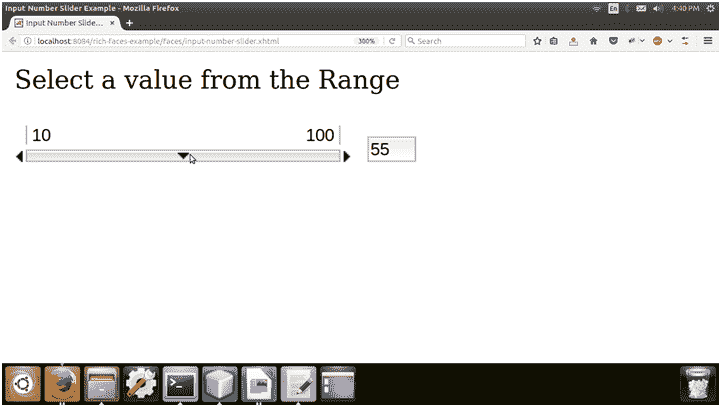

# richfaces〔t0〕

> 原文:[https://www.javatpoint.com/richfaces-rich-inputnumberslider](https://www.javatpoint.com/richfaces-rich-inputnumberslider)

它提供了一个用于更改数值的滑块。它用于通过从滑块范围中进行选择来选择数值。

我们可以通过设置最小值和最大值来指定范围。默认情况下，最小值设置为 0，最大值为 100。滑块标有最小和最大边界值，滑动滑块时会显示显示当前值的工具提示。

## 样式类和外观参数

下表包含了 inputNumberSlider 的样式类(选择器)和相应的外观参数。

| 班级 | 功能 | 皮肤参数 | 映射的 CSS 属性 |
| 。射频 insl | 它用于定义数字滑块本身的样式。 | 没有皮肤参数。 |  |
| 。rf-insl-trc | 它用于定义数字滑块轨道的样式。 | controlbackground color panel bordercolor | 背景色边框-底部颜色 |
| . RF-insl-TRC-CNT | 它用于定义数字滑块轨道容器的样式。 | 没有皮肤参数。 |  |
| 。射频-insl-mn | 它用于定义数字滑块上最小标签的样式。 | 一般大小字体一般家族字体 | 字体大小字体系列 |
| 。射频 insl MX | 它用于定义数字滑块上最大标签的样式。 | 常规家庭字体常规文本颜色 | 字体系列颜色 |
| 。rf-insl-inp | 它用于定义数字滑块上输入字段的样式。 | 常规家庭字体常规文本颜色 | 字体系列颜色 |
| . RF-insl-InP-CNT | 它用于定义输入字段容器的样式。 | 没有皮肤参数。 |  |
| 。射频 insl hnd | 它用于定义数字滑块上手柄的样式。 | 没有皮肤参数。 |  |
| 。RF-insl hnd-CNT 型核潜艇 | 它用于定义手柄容器的样式。 | 没有皮肤参数。 |  |
| 。rf-insl-hnd 盐 | 当选择手柄时，它用于定义手柄的样式。 | 没有皮肤参数。 |  |
| 。rf-insl-hnd-dis | 当选择手柄时，它用于定义手柄的样式。 | 没有皮肤参数。 |  |
| 。rf-insl-dec，。rf-insl 公司 | 这些类为步进控件定义样式，以减少和增加数量。 | 没有皮肤参数。 |  |
| 。射频 insl dec-sel。射频-insl-inc-sel | 这些类为选定的步骤控件定义样式。 | 没有皮肤参数。 |  |
| 。rf-insl-dec-dis(射频-insl-dec-dec-dis)指令。rf-insl 公司-dis | 这些类为禁用的步骤控件定义样式。 | 没有皮肤参数。 |  |
| 。射频 insl-tt | 它用于定义数字滑块上工具提示的样式。 | 一般大小字体一般家族字体 | 字体大小字体系列 |

* * *

## 例子

在下面的例子中，我们实现了<**rich:inputNumberSlider**>组件。本示例包含以下文件。

### JSF 档案

**//输入-数字-滑块. xhtml**

```java

<?xml version='1.0' encoding='UTF-8' ?>
<!DOCTYPE html PUBLIC "-//W3C//DTD XHTML 1.0 Transitional//EN""http://www.w3.org/TR/xhtml1/DTD/xhtml1-transitional.dtd">
<ui:composition 
xmlns:h="http://java.sun.com/jsf/html"
xmlns:f="http://java.sun.com/jsf/core"
xmlns:ui="http://java.sun.com/jsf/facelets"
xmlns:a4j="http://richfaces.org/a4j"
xmlns:rich="http://richfaces.org/rich">
<f:view>
<h:head>
<title>Input Number Slider Example</title>
</h:head>
<h:body>
<h:form>
<h:outputText value="Select a value from the Range"></h:outputText><br/><br/>
<rich:inputNumberSlider 
minValue="10"
maxValue="100"
showArrows="true"
showTooltip="false"
step="5"
>
</rich:inputNumberSlider>
</h:form>
</h:body>
</f:view>
</ui:composition>

```

输出:


滑动滑块后，输入值发生变化。



* * *