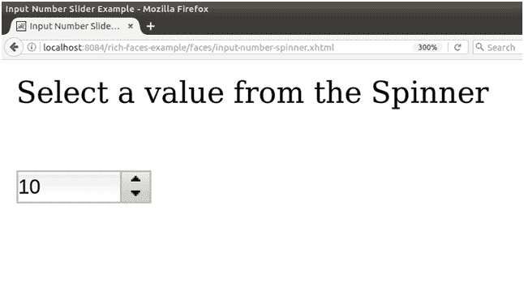

# richfaces〔t0〕

> 原文:[https://www . javatpoint . com/rich faces-rich-inputnumberspinner](https://www.javatpoint.com/richfaces-rich-inputnumberspinner)

该组件是一个单行输入字段，带有增加和减少数值的按钮。它用于使用提供的微调器输入值。可以使用键盘上相应的方向键或通过在字段中键入来更改该值。

## 样式类和外观参数

下表包含 inputNumberSpinner 的样式类和相应的外观参数。

| 班级 | 功能 | 皮肤参数 | 映射的 CSS 属性 |
| 。射频督察 | 它用于定义数字微调器本身的样式。 | panelBorderColor | 边框颜色 |
| 。RF-督察-inp | 它用于为数字微调器上的输入字段定义样式。 | 一般大小字体一般家族字体 | 字体大小字体系列 |
| 。RF-督察-btns | 它用于定义数字微调器上按钮的样式。 | panelBorderColor | 左边框颜色 |
| 。RF-督察-dec。射频督察公司 | 这些类为步进控件定义样式，以减少和增加数量。 | 没有皮肤参数。 |  |
| 。RF-督察-dec-dis。RF-督察-inc-dis | 这些类为禁用的步骤控件定义样式。 | 没有皮肤参数。 |  |

* * *

## 例子

这里，在下面的例子中，我们实现了<**rich:inputNumberSpinner**>组件。本示例包含以下文件。

### JSF 档案

**//输入-数字-微调器. xhtml**

```java

<?xml version='1.0' encoding='UTF-8' ?>
<!DOCTYPE html PUBLIC "-//W3C//DTD XHTML 1.0 Transitional//EN""http://www.w3.org/TR/xhtml1/DTD/xhtml1-transitional.dtd">
<ui:composition 
xmlns:h="http://java.sun.com/jsf/html"
xmlns:f="http://java.sun.com/jsf/core"
xmlns:ui="http://java.sun.com/jsf/facelets"
xmlns:a4j="http://richfaces.org/a4j"
xmlns:rich="http://richfaces.org/rich">
<f:view>
<h:head>
<title>Input Number Slider Example</title>
</h:head>
<h:body>
<h:form>
<h:outputText value="Select a value from the Spinner"></h:outputText><br/><br/>
<rich:inputNumberSpinner
minValue="10"
maxValue="100"
step="5"
>
</rich:inputNumberSpinner>
</h:form>
</h:body>
</f:view>
</ui:composition>

```

输出:



单击微调器后，值发生了变化。


* * *