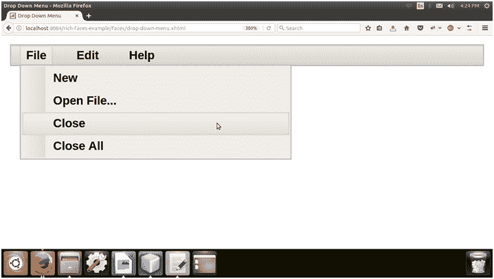

# richfaces〔t0〕

> 原文:[https://www.javatpoint.com/richfaces-rich-dropdownmenu](https://www.javatpoint.com/richfaces-rich-dropdownmenu)

它用于创建下拉菜单或分层菜单。我们可以使用它和< **rich:toolbar** >组件在应用程序的工具栏中创建菜单。

基本用法需要**标签**属性。我们可以使用**标签**属性来设置作为菜单标题出现的文本标签。

## 样式类和外观参数

下表包含下拉菜单的样式类(选择器)和相应的外观参数。

| 班级 | 功能 | 皮肤参数 | 映射的 CSS 属性 |
| 。rf-ddm-lbl | 它用于定义下拉菜单标签的样式。 | headerFamilyFont | 字体系列 |
| .rf-ddm-dis | 它用于在下拉菜单被禁用时为其定义样式。 | tabDisabledTextColor | 颜色 |
| 。RF DDM LBL dis | 它用于在下拉菜单被禁用时为其标签定义样式。 | headerFamilyFont | 字体系列 |
| .rf-ddm-pos | 它用于定义下拉菜单的位置。 | 没有皮肤参数。 |  |
| 。rf-ddm-lbl-unsel | 当下拉菜单未被选中时，它用于定义标签的样式。 | 没有皮肤参数。 |  |
| 。RF ddm lst(射频 DDM) | 它用于定义下拉列表的样式。 | panel border color additional background color | 边框颜色背景颜色 |
| 。RF DDM–lst-BG | 它用于定义下拉列表背景的样式。 | 附加背景颜色 | 边框颜色 |
| . RF DDM 子功能 | 当用作子菜单时，它用于定义菜单的位置。 | 没有皮肤参数。 |  |
| .rf-ddm-itm | 它用于定义菜单项的样式。 | 通用系列字体通用尺寸字体 | 字体系列字体大小 |
| 。RF DDM ITM sel | 它用于定义菜单项被选中时的样式。 | tabBackgroundColor | 背景色 |
| 。rf-ddm-itm-unsel | 当菜单项未被选中时，它用于定义菜单项的样式。 | 没有皮肤参数。 |  |
| 。RF DDM ITM dis | 当菜单项被禁用时，它用于定义菜单项的样式。 | tabDisabledTextColor | 颜色 |
| 。RF DDM ITM LBL | 它用于定义菜单项中标签的样式。 | 常规文本颜色 | 颜色 |
| 。RF DDM ITM IC | 它用于定义菜单项中图标的样式。 | 没有皮肤参数。 |  |
| . RF DDM–emptyicon | 它用于为菜单项中的空图标定义样式。 | 没有皮肤参数。 |  |
| .rf-ddm-sep | 它用于定义菜单分隔符的样式。 | panelBorderColor | 边框-顶部颜色 |
| 。rf-ddm-nd | 它用于定义菜单节点的样式。 | 没有皮肤参数。 |  |

* * *

## 例子

在下面的例子中，我们实现了< **rich:dropDownMenu** >组件。本示例包含以下文件。

### JSF 档案

**//下拉菜单. xhtml**

```java

<ui:composition 
xmlns:h="http://java.sun.com/jsf/html"
xmlns:a4j="http://richfaces.org/a4j"
xmlns:rich="http://richfaces.org/rich"
xmlns:f="http://java.sun.com/jsf/core"
xmlns:ui="http://java.sun.com/jsf/facelets">
<f:view>
<h:head>
<title>Drop Down Menu </title>
</h:head>
<h:body>
<h:form>
<rich:toolbar>
<rich:dropDownMenu>
<f:facet name="label">
<h:outputText value="File" />
</f:facet>
<rich:menuItem label="New" />
<rich:menuItem label="Open File..." />
<rich:menuItem label="Close" />
<rich:menuItem label="Close All" />
</rich:dropDownMenu>
<rich:dropDownMenu>
<f:facet name="label">
<h:outputText value="Edit" />
</f:facet>
<rich:menuItem label="Cut" />
<rich:menuItem label="Undo" />
<rich:menuItem label="Redo" />
</rich:dropDownMenu>
<rich:dropDownMenu>
<f:facet name="label">
<h:outputText value="Help" />
</f:facet>
<rich:menuItem label="About Us" />
</rich:dropDownMenu>
</rich:toolbar>
</h:form>
</h:body>
</f:view>
</ui:composition>

```

输出:

 

* * *