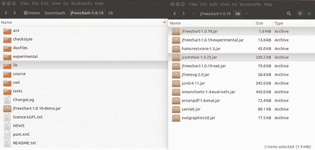

# 安装 JfreeChart

> 原文:[https://www.javatpoint.com/jfreechart-installation](https://www.javatpoint.com/jfreechart-installation)

最新版本的 JfreeChart 可从以下网站下载:

[downloaded](http://www.jfree.org/jfreechart/download/)

*   JFreeChart 有两个版本。根据您的操作系统下载。

| 文件: | 描述: |
| jfreechart-1.0.19.tar.gz | 适用于 Linux/Unix 的 JFreeChart。 |
| jfreechart-1.0.19.zip | 适用于 Windows 的 JFreeChart。 |

*   下载 JFreeChart 后，您需要在一个方便的目录中提取文件，所需的库可以从该目录链接到您的 Java 程序中。
*   在安装 JfreeChart 之前，我们假设您已经在机器上安装了 Java 1 . 7 . 0 _ 60 版本(jdk1.7.0_60)。
*   顶层目录(jfreechart-1.0.19)包含下表中列出的文件和目录:

| 文件/目录 | 描述 |
| 蚂蚁 | 包含 Ant build.xml 脚本的目录。您可以使用该脚本从发行版中包含的源代码重建 JFreeChart。 |
| 校验和样式 | 包含多个 checkstyle 属性文件的目录。这些定义了 JFreeChart 源代码中使用的编码约定。 |
| 实验的 | 包含不属于标准 JFreeChart API 的类的源文件的目录。 |
| Gjdoc | 包含使用 gjdoc 实用程序生成 JFreeChart API 文档的脚本的目录。 |
| 解放运动 | 包含 JFreeChart jar 文件和 JFreeChart 使用的其他库的目录。 |
| 来源 | 包含 JFreeChart 源代码的目录。 |
| 短波无线电发射(Short-wave Transmission) | 包含实验 SWT 代码源代码的目录。请注意，这些类的应用编程接口可能会发生变化。 |
| 试验 | 包含 JFreeChart 单元测试源代码的目录。 |
| 变更日志 | 对 JFreeChart 所做更改的详细日志。 |
| jfreechart-1.0.19 演示版。jar | 包含演示应用程序的可运行 jar 文件。 |
| 授权-LGPL.txt | JFreeChart 许可证(GNU LGPL)。 |
| 新闻ˌ消息 | 项目新闻。 |
| 自述文件.txt | 重要信息-先看这个！ |

*   下图显示了目录和文件的结构-

*   一旦下载的文件被解压到您选择的目录中，任何使用 JFreeChart 的应用程序的类路径都需要至少指向 jfreechart-1.0.19.jar 和 jcommon-1.0.23.jar 文件。
*   您可以将这些 JAR 文件添加到您最喜欢的 IDE 项目中。
*   在 ide 外部安装的情况下，Java SE 允许使用通配符来指定类路径中的 jar，因此 JFreeChart lib 目录中的 jar 可以包含在一个*。类路径中的 jar 表达式。
*   将 jfreechart-1.0.19.jar 和 jcommon-1.0.23.jar 文件的完整路径添加到如下所示的类路径中:

**对于窗口:**将字符串“C:\ jfreechart-1 . 0 . 19 \ lib \ jfreechart-1 . 0 . 19 . jar”和“C:\ jfreechart-1 . 0 . 19 \ lib \ jcommon-1 . 0 . 23 . jar”追加到用户变量 CLASSPATH 的末尾。

**对于 Linux:**Export class path = $ class path:/usr/share/jfreechart 1 . 0 . 19/lib/jfreechart-1 . 0 . 19 . jar:/usr/share/jfreechart-1 . 0 . 19/lib/jcommon 1 . 0 . 23 . jar

1.  为了在诸如“ECLIPSE”这样的集成开发环境中构建和运行 JFreeChart，我们简要概述了设置 Java 项目所需的步骤，以便您可以创建自己的 JFreeChart 图形。

**步骤:**

*   启动 Eclipse OXYGEN(如果您没有安装 Eclipse，请访问“www.eclipse.org”下载最新版本。)
*   转到文件->新建->项目。
*   选择“Java 项目”并点击“下一步”。
*   输入项目名称，然后单击“完成”。
*   在包资源管理器视图中选择项目。转到项目->属性。
*   单击对话框左侧的“Java 构建路径”，在右侧单击“库”选项卡。
*   点击“添加外部 jar”，找到 jfreechart-1.0.19.jar 和 jcommon-1.0.23.jar，点击确定。
*   下图显示了为 JFreeChart 添加外部 jar 文件后的属性窗口。

*   在包资源管理器视图中选择项目。转到文件->新建->包。为包命名，然后单击“完成”。
*   在包资源管理器视图中选择新创建的包。转到文件->新建->类。给班级起一个名字，然后点击完成。
*   您现在可以使用 JFreeChart 库了！

*   要在 JFreeChart 库和 MySql 数据库之间建立连接，需要将类路径设置为“MySQL-connector-Java-5 . 0 . 8-bin . jar”。