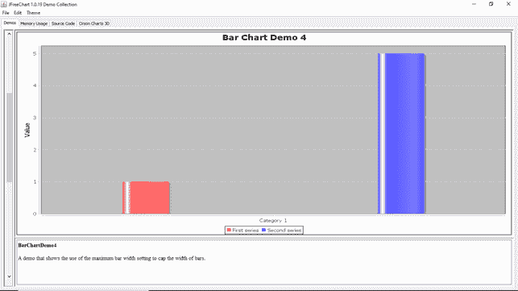

# 图表-条形图

> 原文：<https://www.javatpoint.com/jfreechart-bar-chart>

条形图是用矩形表示分组数据的图表。条形的高度或长度与代表条形的值相关。

以下图像显示了 JFreeChart 库中合并的条形图的一些演示版本:

**条形图演示 1:**


**条形图演示 2:**


**条形图演示 3:**


**条形图演示 4:**



## 条形图示例

让我们考虑条形图示例的输入数据示例。

| 年 | 百万人口 |
| 美利坚合众国 | 印度 | 瓷器；（China）中国 |
| Two thousand and five | Ten | Fifteen | Twenty |
| Two thousand and ten | Fifteen | Twenty | Twenty-five |
| Two thousand and fifteen | Twenty | Twenty-five | Thirty |

以下代码根据上述示例数据创建了一个条形图:

## 条形图示例.java

```java

import javax.swing.JFrame;
import javax.swing.SwingUtilities;

import org.jfree.chart.ChartFactory;
import org.jfree.chart.ChartPanel;
import org.jfree.chart.JFreeChart;
import org.jfree.chart.plot.PlotOrientation;
import org.jfree.data.category.CategoryDataset;
import org.jfree.data.category.DefaultCategoryDataset;

public class BarChartExample extends JFrame {

  private static final long serialVersionUID = 1L;

  public BarChartExample(String appTitle) {
    super(appTitle);

    // Create Dataset
    CategoryDataset dataset = createDataset();

    //Create chart
    JFreeChart chart=ChartFactory.createBarChart(
        "Bar Chart Example", //Chart Title
        "Year", // Category axis
        "Population in Million", // Value axis
        dataset,
        PlotOrientation.VERTICAL,
        true,true,false
       );

    ChartPanel panel=new ChartPanel(chart);
    setContentPane(panel);
  }

  private CategoryDataset createDataset() {
    DefaultCategoryDataset dataset = new DefaultCategoryDataset();

    // Population in 2005
    dataset.addValue(10, "USA", "2005");
    dataset.addValue(15, "India", "2005");
    dataset.addValue(20, "China", "2005");

    // Population in 2010
    dataset.addValue(15, "USA", "2010");
    dataset.addValue(20, "India", "2010");
    dataset.addValue(25, "China", "2010");

    // Population in 2015
    dataset.addValue(20, "USA", "2015");
    dataset.addValue(25, "India", "2015");
    dataset.addValue(30, "China", "2015");

    return dataset;
  }

  public static void main(String[] args) throws Exception {
    SwingUtilities.invokeAndWait(()->{
      BarChartExample example=new BarChartExample("Bar Chart Window");
      example.setSize(800, 400);
      example.setLocationRelativeTo(null);
      example.setDefaultCloseOperation(WindowConstants.EXIT_ON_CLOSE);
      example.setVisible(true);
    });
  }
}

```

**输出:**

