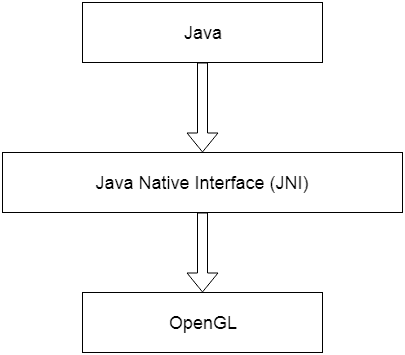

# 介绍

> 原文:[https://www.javatpoint.com/jogl-introduction](https://www.javatpoint.com/jogl-introduction)

Java 开放图形库(JOGL)是一个包装库，允许使用 OpenGL 和 Java 编程语言。因此，在 JOGL 的帮助下，程序员可以很容易地将计算机图形嵌入到 Java 代码中。

JOGL 是一个开放源码库，可以访问 OpenGL 的完整 API。因此，它继承了 OpenGL 的所有特性。JOGL 能够在任何类型的操作系统上运行，如视窗、Linux 和苹果电脑。

## 什么是开放图形库(OpenGL)？

OpenGL 是一个独立于平台的应用编程接口(API)，用于绘制二维和三维图形应用。它的主要重点是构建基于硬件的对象，而不是软件。

OpenGL APIs 与图形处理单元(GPU)交互，以操纵和加速图像的创建。因此，这些应用编程接口被设计成主要在硬件中实现。

## JOGL 历史

*   最初，JOGL 是由肯尼斯·布拉德利·拉塞尔和克里斯托弗·约翰·克莱恩开发的。
*   后来被太阳微系统公司收购。
*   目前，它由 JogAmp(Java on Graphics，Audio，Media and Processing)维护。

## Java 原生接口

Java 本机接口(JNI)是一个编程框架，它允许 Java 程序调用或被用其他语言编写的本机应用程序和库调用。因此，Java 通过 Java 本机接口支持本机代码。

在 JOGL，JNI 的作用是提供一个平台，通过它你可以访问各种各样的 OpenGL 功能。因此，JNI 在 Java 和 OpenGL 之间扮演了一个调停者的角色。

