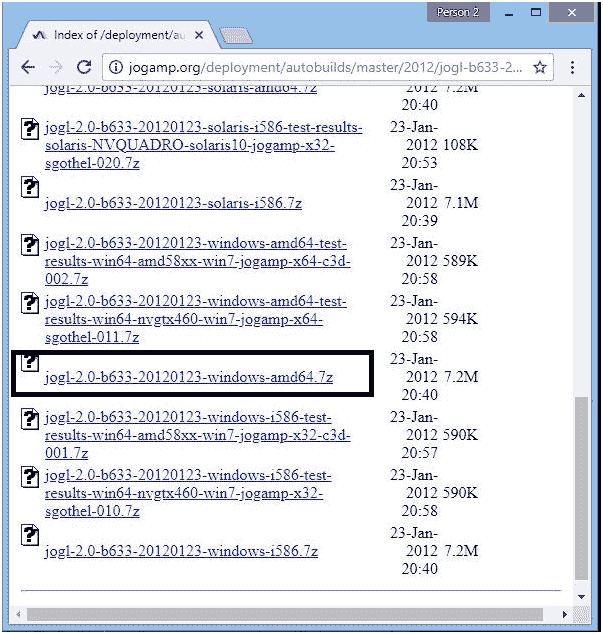
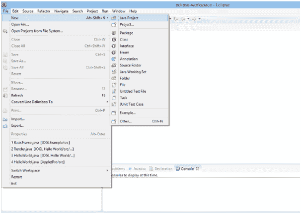
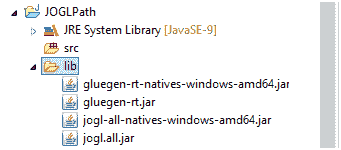

# JOGL 装置

> 原文：<https://www.javatpoint.com/jogl-installation>

在本节中，我们将了解 JOGL 在我们的操作系统中的安装。因此，下载和安装 JOGL 遵循以下步骤:-

*   在安装 JOGL 之前，需要在我们的系统中安装 Java。因此，如果我们的系统中没有安装 Java，请按照下面的链接进行安装。[如何在 Java 中设置路径](https://www.javatpoint.com/how-to-set-path-in-java)
*   安装 Java 后，请按照下面的链接下载 JOGL。下载包含在黑色矩形中的 zip 文件并提取它。[下载 JOGL](http://jogamp.org/deployment/autobuilds/master/2012/jogl-b633-2012-01-23_20-37-13/)

下载包含在黑色矩形中的 zip 文件并提取它。[下载 Gluegen](http://jogamp.org/deployment/autobuilds/master/2012/gluegen-b480-2012-01-23_16-49-04/)

*   现在，打开 eclipse，点击文件>新建> Java 项目，创建一个新的 Java 项目。

为 Java 项目提供任何特定的名称。这里，我们提供 JOGLPath。

*   在此项目中创建新的文件夹库。将以下 jar 文件复制到该文件夹下。
    *   gluten-rt 原生 windows amd64 . jar
    *   格吕根类型. jar
    *   jogl-所有本地人-windows-amd64.jar
    *   乔尔·阿尔·贾尔

*   现在，选择所有的 jar 文件，然后右击鼠标。然后单击构建路径>添加到构建路径。

现在，创建 JOGL 计划所需的基本设置已经准备就绪。我们稍后将了解 JOGL 计划。