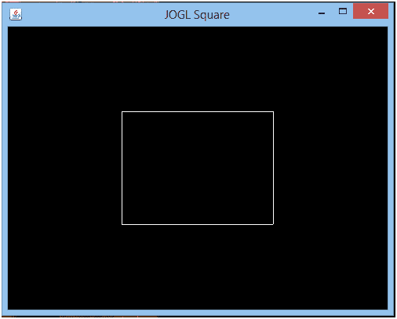
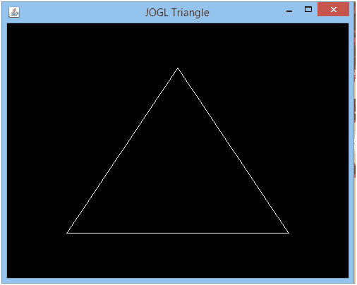

# JOGL·2D 物件

> 原文:[https://www.javatpoint.com/jogl-2d-objects](https://www.javatpoint.com/jogl-2d-objects)

在上一节中，我们已经学习了如何在 JOGL 画一条基本的线。使用同样的方法，我们也可以绘制各种类型的形状，如正方形，矩形，三角形等。

## JOGL 广场示例

在这个例子中，我们将绘制四条不同的边，它们都在一个正方形的点上连接。

```java

package com.javatpoint.jogl;
import javax.media.opengl.*;
import javax.media.opengl.awt.GLCanvas;
import javax.swing.JFrame;

public class Square implements GLEventListener {

	@Override
public void init(GLAutoDrawable arg0) 
  {

  }

   @Override
public void display(GLAutoDrawable drawable) {
final GL2 gl = drawable.getGL().getGL2();

      //Drawing top edge
gl.glBegin( GL2.GL_LINES );
gl.glVertex2d(-0.4, 0.4);
gl.glVertex2d(0.4, 0.4);
gl.glEnd();

//Drawing bottom edge
gl.glBegin( GL2.GL_LINES );
gl.glVertex2d(-0.4,-0.4);
gl.glVertex2d(0.4, -0.4);
gl.glEnd();

      //Drawing right edge
gl.glBegin( GL2.GL_LINES );
gl.glVertex2d(-0.4, 0.4);
gl.glVertex2d(-0.4, -0.4);
gl.glEnd();

      //Drawing left edge
gl.glBegin( GL2.GL_LINES );
gl.glVertex2d(0.4, 0.4);
gl.glVertex2d(0.4, -0.4);
gl.glEnd();
   }      
   @Override
public void reshape(GLAutoDrawable arg0, int arg1, int arg2, int arg3, int arg4) 
   {	

   }
   @Override
public void dispose(GLAutoDrawable arg0) 
   {

   }

public static void main(String[] args) {

final GLProfile gp = GLProfile.get(GLProfile.GL2);
GLCapabilities cap = new GLCapabilities(gp);

final GLCanvas gc = new GLCanvas(cap);
      Square sq = new Square();
gc.addGLEventListener(sq);
gc.setSize(400, 400);

final JFrame frame = new JFrame("JOGL Line");
frame.add(gc);
frame.setSize(500,400);
frame.setVisible(true);  
   }	
}

```

**输出:**



## JOGL 三角示例

在这个例子中，我们将绘制三条不同的边，它们都连接在三角形的一个点上。

**Triangle.java**

```java

package com.javatpoint.jogl;
import javax.media.opengl.*;
import javax.media.opengl.awt.GLCanvas;
import javax.swing.JFrame;

public class Triangle implements GLEventListener {

	@Override
public void init(GLAutoDrawable arg0) 
  {

  }

   @Override
public void display(GLAutoDrawable drawable) {
final GL2 gl = drawable.getGL().getGL2();

      // Base edge
gl.glBegin (GL2.GL_LINES);
gl.glVertex2d(-0.65, -0.65);
gl.glVertex2d(0.65, -0.65);
gl.glEnd();

      //Right edge
gl.glBegin (GL2.GL_LINES);
gl.glVertex2d(0, 0.65);
gl.glVertex2d(-0.65, -0.65);
gl.glEnd();

      //Left edge
gl.glBegin (GL2.GL_LINES);
gl.glVertex2d(0, 0.65);
gl.glVertex2d(0.65, -0.65);
gl.glEnd();
gl.glFlush();
   }      
   @Override
public void reshape(GLAutoDrawable arg0, int arg1, int arg2, int arg3, int arg4) 
   {	

   }
   @Override
public void dispose(GLAutoDrawable arg0) 
   {

   }

public static void main(String[] args) {

final GLProfile gp = GLProfile.get(GLProfile.GL2);
GLCapabilities cap = new GLCapabilities(gp);

final GLCanvas gc = new GLCanvas(cap);
      Triangle tr= new Triangle();
gc.addGLEventListener(tr);
gc.setSize(400, 400);

final JFrame frame = new JFrame("JOGL Triangle");
frame.add(gc);
frame.setSize(500,400);
frame.setVisible(true);  
   }	
}

```

**输出:**



因此，任何类型的图形都可以通过连接特定形状的线条来设计。