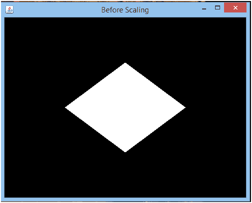
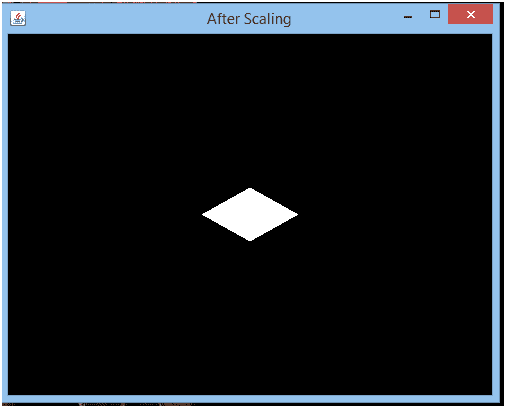

# JOGL 标度

> 原文：<https://www.javatpoint.com/jogl-scaling>

在 JOGL，缩放用于增加或减少对象的大小。它操纵物体的物理尺寸。因此，通过缩放，对象可以从其任何轴拉伸或收缩。

要缩放对象，请使用以下语法:

```java

glScalef(float a, float b, float c)

```

这里，glScalef()方法是由 GLMatrixFunc 接口提供的，带有表示维度的参数。

## JOGL 缩放示例

在这个例子中，我们将减少多边形的尺寸。

```java

package com.javatpoint.jogl;

	import javax.media.opengl.*;
	import javax.media.opengl.awt.GLCanvas; 

	import javax.swing.JFrame;

	public class JScaling implements GLEventListener {

	   @Override 

	public void display( GLAutoDrawable drawable ) { 

	final GL2 gl = drawable.getGL().getGL2(); 

	gl.glScalef( 0.40f,0.30f,0.40f ); 

		gl.glBegin(GL2.GL_QUADS);

		gl.glVertex3f( 0.0f,0.5f,0);
		gl.glVertex3f(-0.5f,0f,0);
		gl.glVertex3f(0f,-0.5f,0);
		gl.glVertex3f(0.5f,0f,0);

		gl.glEnd();

	   }

	   @Override 
	public void dispose( GLAutoDrawable arg0 ) { 
	   } 

	   @Override 
	public void init( GLAutoDrawable arg0 ) { 
	   } 

	   @Override 
	public void reshape( GLAutoDrawable arg0, int arg1, int arg2, int arg3, int arg4 ) { 
	   }

	public static void main( String[] args ) {   

		final GLProfile gp = GLProfile.get(GLProfile.GL2);
		GLCapabilities cap = new GLCapabilities(gp);

		final GLCanvas gc = new GLCanvas(cap);
		JScaling js= new JScaling();
		gc.addGLEventListener(js);
		gc.setSize(400, 400);

		final JFrame frame = new JFrame("After Scaling");
		frame.add(gc);
		frame.setSize(500,400);
		frame.setVisible(true);  
	   } 

	}

```

**输出:**


