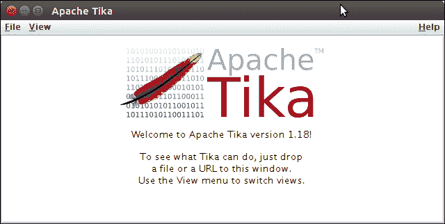

# Apache Tika 安装

> 原文：<https://www.javatpoint.com/tika-installation>

要安装 Tika，我们可以根据需要使用几种方法。下面给出了一些常见的安装选项。

1.  来源发布
2.  马文依赖
3.  命令行实用程序

#### 注意:Tika 1.18 需要 Java 7 或更高版本才能实现。

## 1.来源发布

首先访问 Apache Tike 的官方网站，并从那里下载最新版本。下载后，我们可以使用它的库在我们的应用程序中实现。

Tika 构建包含以下组件。

| 成分 | 描述 |
| tika-核心/目标/tika-核心-*。冲突 | 它是包含核心类和接口的核心库。 |
| tika-parsers/target/tika-parsers-*.jar | 这是一个 Tika 解析器库。它包含基于外部库实现 Tika Parser 接口的类。 |
| tika-app/target/tika-app-*。冲突 | 一个 Tika 应用程序，它是一个可运行的 jar，具有图形用户界面和命令行界面。 |
| tika-服务器/目标/tika-服务器-*。冲突 | 它包含 Tika JAX-RS REST 应用程序。 |
| tika-bundle/target/tika-bundle-*。冲突 | 它是一个 OSGI 包，包含带有非 OSGified 解析器库的 tika 解析器。这使得它们易于在 OSGI 环境中部署。 |
| was-eval/target/was-eval-*.jar | 它提供了一个命令行工具来评估 Tika 的输出。 |

2.为了在 maven 项目中实现 Tika，我们可以在 **pom.xml** 文件中使用以下依赖项。

```java

<dependencies>
  	<dependency>
    <groupId>org.apache.tika</groupId>
    <artifactId>tika-core</artifactId>
    <version>1.18</version>
  </dependency>

	<dependency>
    <groupId>org.apache.tika</groupId>
    <artifactId>tika-parsers</artifactId>
    <version>1.18</version>
  </dependency>

```

## 3.命令行实用程序

除了源代码，我们还可以从官方网站下载 jar 文件。该文件是可运行的，可以使用以下命令运行。

```java

java -jar tika-app-1.18.jar --gui

```

该命令将打开一个图形用户界面窗口，如下所示:

