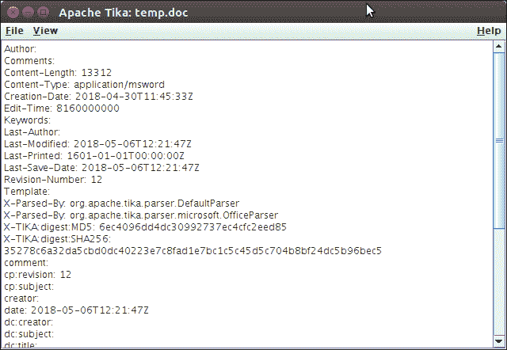

# Tika 图形用户界面应用程序

> 原文：<https://www.javatpoint.com/tika-gui-application>

除了我们从 Tika 官方网站下载的源代码，还提供了一个 Jar 文件。该文件是一个可运行的应用程序，运行具有图形用户界面的 tika 应用程序。

它为用户提供了一个界面，并允许拖放文件以获取提取的内容。

要实现它，如果没有从官方网站下载，就下载 jar。下载后，使用以下命令运行它。

## 运行 Tika 应用程序

定位到下载的 Jar 文件位置，并使用终端执行命令。

```java

$ java -jar tika-app-1.18.jar

```

执行命令后，它显示了以下用户界面，这意味着我们的 Tika 应用程序正在运行。


现在，我们可以将文档拖到这个界面，它将立即显示内容和元数据。请看例子。

假设我们正在拖放一个包含以下内容的文档文件。

**//文件内容**

Apache Tika 安装

要安装 Tika，我们可以根据需要使用几种方法。下面给出了一些常见的安装选项。

1.  来源发布
2.  马文依赖
3.  命令行实用程序

#### 注意:Tika 1.18 需要 Java 7 或更高版本才能实现。

**输出:**

```java
// metadata

```



```java
// content

```

