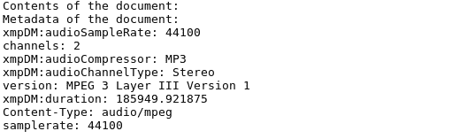

# Tika Mp3 文件提取

> 原文：<https://www.javatpoint.com/tika-mp3-file-extraction>

Tika Mp3Parser 是一个用于解析 Mp3 文件的内容和元数据的类。它位于**org . Apache . tika . parser . MP3**包中。

它包含以下构造函数和方法。

## Tika 播放器构造器

以下是 MP3Parser 类的构造函数。

| 构造器 | 描述 |
| 公共 Mp3Parser() | 它用于创建类的实例。 |

## Tika MP3Parser 方法

下面是 MP3Parser 类的方法。

| 方法 | 描述 |
| public set<mediatype>getsupportedtype(parse context)</mediatype> | 当与给定的解析上下文一起使用时，它返回该解析器支持的媒体类型集。 |
| 公共 void 解析(InputStream 流、ContentHandler 处理程序、元数据、ParseContext 上下文)引发 IOException、SAXException、TikaException | 它将文档流解析成一系列 XHTML SAX 事件。在给定的元数据对象中填充相关的文档元数据。 |
| 受保护的静态 Mp3 播放器。ID3 tagsandaudio getAllTagHandlers(InputStream 流，ContentHandler 处理程序)引发 IOException，SAXException，TikaException | 它扫描 MP3 帧中的 ID3 标签，并为每个支持的标签集创建 ID3 标签处理程序。 |

## Tika 播放器示例

在下面的例子中，我们从 mp3 文件中提取数据。请看例子。

```java

package tikaexample;
import java.io.File;
import java.io.FileInputStream;
import java.io.IOException;
import org.apache.tika.exception.TikaException;
import org.apache.tika.metadata.Metadata;
import org.apache.tika.parser.ParseContext;
import org.apache.tika.parser.mp3.LyricsHandler;
import org.apache.tika.parser.mp3.Mp3Parser;
import org.apache.tika.sax.BodyContentHandler;
import org.xml.sax.SAXException;
public class Mp3ParserExample {
   public static void main(final String[] args) throws Exception, IOException, SAXException, TikaException {
      BodyContentHandler handler = new BodyContentHandler();
      Metadata metadata = new Metadata();
      FileInputStream inputstream = new FileInputStream(new File("javatpoint.mp3"));
      ParseContext pcontext = new ParseContext();
      Mp3Parser  Mp3Parser = new  Mp3Parser();
      Mp3Parser.parse(inputstream, handler, metadata, pcontext);
      LyricsHandler lyrics = new LyricsHandler(inputstream,handler);
      while(lyrics.hasLyrics()) {
    	  System.out.println(lyrics.toString());
      }
      System.out.println("Contents of the document:" + handler.toString());
      System.out.println("Metadata of the document:");
      String[] metadataNames = metadata.names();
      for(String name : metadataNames) {		        
    	  System.out.println(name + ": " + metadata.get(name));
      }
   }
}

```

**输出:**

