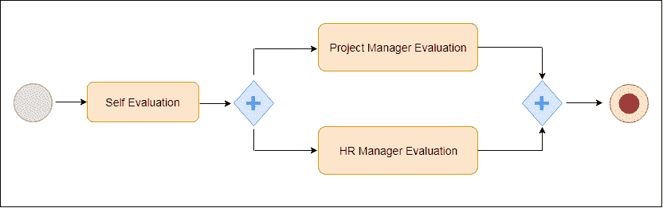

# jBPM 教程

> 原文:[https://www.javatpoint.com/jbpm-tutorial](https://www.javatpoint.com/jbpm-tutorial)

jBPM 教程提供了 jBPM 的基本和高级概念。我们的 jBPM 教程是为初学者和专业人士设计的。

jBPM 代表 Java 业务流程管理。这是一个用 Java 语言编写的灵活的业务流程管理套件。它重量轻，本质上是完全开源的。它允许我们在业务流程的整个生命周期中创建、部署、执行和监控业务流程。它填补了业务分析师和开发人员之间的空白。它是根据 Apache 许可证分发的，并由 JBoss 公司根据美国手语发布。

我们的 jBPM 教程包括 jBPM 教程的所有主题，如 jBPM 特性、jBPM Eclipse 插件、Hello World 示例、jBPM 运行时、核心引擎 API、jBPM 服务、jBPM 流程、jBPM 组件、WorkFlow 组件、WorkFlow 验证、jBPM WorkFlow 示例等。

## 什么是 jBPM？

jBPM 代表 Java 业务流程管理。这是一个用 Java 语言编写的灵活的业务流程管理套件。它重量轻，本质上是完全开源的。它允许我们在业务流程的整个生命周期中创建、部署、执行和监控业务流程。它填补了业务分析师和开发人员之间的空白。它以 **Apache 许可证**发行，并由 **JBoss** 公司以 **ASL** 发行。

## 什么是业务流程？

业务流程是一组活动，这些活动按照特定的顺序遵循一定数量的步骤来实现组织目标。这些目标的顺序用流程图描述。这些流程可以显著提高我们业务逻辑的可见性和敏捷性。

每个业务流程都需要在其整个生命周期中得到支持。这些生命周期包括:创作、部署、流程管理和任务列表以及仪表板和报告。

下面是一个图形流程图示例，帮助您轻松理解业务流程。

上述过程按以下顺序进行:

*   首先，员工自我评估，并将这些自我评估报告提交给项目经理。
*   现在，项目经理和人力资源经理都会评估他们的绩效，并根据评估结果给出评分。
*   最后，反馈将提供给员工。

* * *

## jBPM 索引

* * *

**jBPM 教程**

*   [jBPM 教程](jbpm-tutorial)
*   [jBPM 功能](jbpm-features)
*   [jBPM Eclipse 插件](jbpm-eclipse-plugin)
*   [你好世界示例](jbpm-hello-world-example)
*   [jBPM 运行时](jbpm-runtime)
*   [核心引擎 API](jbpm-core-engine-api)
*   [jBPM 服务](jbpm-services)

*   [jBPM 流程](jbpm-processes)
*   [jBPM 流程设计师](jbpm-process-designer)
*   [jBPM 人工任务](jbpm-human-task)
*   [持续性和交易](jbpm-persistence-and-transaction)
*   [jBPM 组件](jbpm-component)
*   [工作流组件](jbpm-workflow-component)
*   [工作流验证](jbpm-workflow-validation)
*   [工作流程示例](jbpm-workflow-example)
*   [jBPM 远程服务](jbpm-remote-service)

* * *

## 先决条件

在学习 jBPM 教程之前，您必须具备 JAVA 和业务流程与应用的基础知识。

## 观众

我们的 jBPM 教程旨在帮助初学者和专业人士。

## 问题

我们保证您在这个 jBPM 教程中不会发现任何问题。但是如果有任何错误，请在联系表格中发布问题。