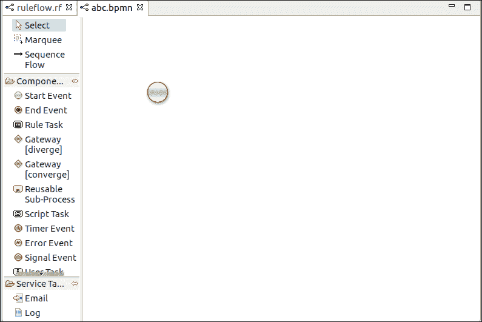

# jBPM 流程

> 原文:[https://www.javatpoint.com/jbpm-processes](https://www.javatpoint.com/jbpm-processes)

在 BPMN 的帮助下，JBPM 进程很容易理解。

## 什么是 BPMN 2.0？

*   它代表业务流程模型和符号。
*   它基于对象管理组规范。
*   类似于流程图。
*   它的主要目标是提供一种所有业务用户都容易理解的符号，即从业务分析师到技术人员，最后到管理和监控这些流程的业务用户。
*   它不仅定义了一个如何用图形表示业务流程的标准，还包括为定义的元素执行语义，以及存储流程定义的 XML 格式。
*   BPMN 由不同类型的节点组成，这些节点使用序列流相互连接。BPMN 由三种不同类型的节点组成。它们是:

*   **事件:**开始事件、结束事件和中间事件。
*   **活动:**脚本任务、用户任务、服务任务、业务规则任务等。
*   **网关:**发散网关，汇聚网关

## 流程创建

有三种方法可以创建流程:

1.  使用图形 BPMN2 编辑器
2.  使用 XML 定义流程
3.  通过使用流程 API 直接创建流程。

## 使用图形 BPMN2 编辑器

BPMN2 是一个 Eclipse 插件。它提供了一个编辑器，允许我们使用拖放选项创建一个进程。使用拖放选项创建节点后，我们可以编辑其属性。

要在 jBPM 项目中打开 BPMN 编辑器，右键单击要保存流程的目录，选择新建，然后单击文件，给出文件名并保存。bpmn 扩展。这将打开流程编辑器，如下图所示。



在这个编辑器中，我们可以通过添加节点来创建一个流程，该节点表示我们想要在业务流程中指定的业务逻辑。

## 使用 XML 定义流程

我们也可以直接使用 BPMN2.0 XML 指定流程。这些 XML 过程的语法是通过使用 BPMN2.0 XML 模式定义来定义的。流程 XML 文件由两部分组成:上部和下部。

上半部分有不同节点及其属性的定义，下半部分有所有图形信息。流程 XML 只包含一个<process>元素。</process>

**示例:**这里，我们创建一个包含开始事件、打印“Hello World”的脚本任务和结束事件的流程。

```java

<?xml version="1.0" encoding="UTF-8"?>

<definitions id="Definition"
             targetNamespace="http://www.jboss.org/drools"
             typeLanguage="http://www.java.com/javaTypes"
             expressionLanguage="http://www.mvel.org/2.0"
             Rule Task
             xmlns:xsi="http://www.w3.org/2001/XMLSchema-instance"
             xsi:schemaLocation="http://www.omg.org/spec/BPMN/20100524/MODEL BPMN20.xsd"
             xmlns:g="http://www.jboss.org/drools/flow/gpd"
             xmlns:bpmndi="http://www.omg.org/spec/BPMN/20100524/DI"
             xmlns:dc="http://www.omg.org/spec/DD/20100524/DC"
             xmlns:di="http://www.omg.org/spec/DD/20100524/DI"
             xmlns:tns="http://www.jboss.org/drools">

  <process processType="Private" isExecutable="true" id="com.sample.hello" name="Hello Process" >

    <!-- nodes -->
    <startEvent id="_1" name="Start" />
    <scriptTask id="_2" name="Hello" >
      <script>System.out.println("Hello World");</script>
    </scriptTask>
    <endEvent id="_3" name="End" >
        <terminateEventDefinition/>
    </endEvent>

    <!-- connections -->
    <sequenceFlow id="_1-_2" sourceRef="_1" targetRef="_2" />
    <sequenceFlow id="_2-_3" sourceRef="_2" targetRef="_3" />

  </process>

  <bpmndi:BPMNDiagram>
    <bpmndi:BPMNPlane bpmnElement="com.sample.hello" >
      <bpmndi:BPMNShape bpmnElement="_1" >
        <dc:Bounds x="16" y="16" width="48" height="48" />
      </bpmndi:BPMNShape>
      <bpmndi:BPMNShape bpmnElement="_2" >
        <dc:Bounds x="96" y="16" width="80" height="48" />
      </bpmndi:BPMNShape>
      <bpmndi:BPMNShape bpmnElement="_3" >
        <dc:Bounds x="208" y="16" width="48" height="48" />
      </bpmndi:BPMNShape>
      <bpmndi:BPMNEdge bpmnElement="_1-_2" >
        <di:waypoint x="40" y="40" />
        <di:waypoint x="136" y="40" />
      </bpmndi:BPMNEdge>
      <bpmndi:BPMNEdge bpmnElement="_2-_3" >
        <di:waypoint x="136" y="40" />
        <di:waypoint x="232" y="40" />
      </bpmndi:BPMNEdge>
    </bpmndi:BPMNPlane>
  </bpmndi:BPMNDiagram>

</definitions>

```