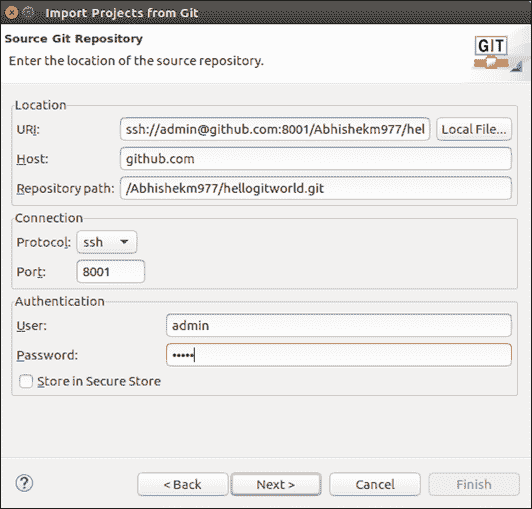

# JBPM 流程设计师

> 原文:[https://www.javatpoint.com/jbpm-process-designer](https://www.javatpoint.com/jbpm-process-designer)

业务分析师对应用程序要求的第一步是业务流程的设计和建模。除了业务流程本身之外，它还涉及多个人工制品。本节描述了如何设计一个具有所有礼仪的业务流程，并有助于理解所设计的业务流程在运行时环境中的行为。

jBPM 提供了一个设计业务流程的工具。这些工具是-

## 基于网络的工具

基于网络的工具是为 Drools Guvnor 知识库提供的用户界面框架的扩展。它为基于知识的应用程序提供了创建、维护和运行多个知识资产的平台。

在本节中，我们将重点关注业务流程定义、流程和任务表单，以及作为 jBPM 一部分的数据模型。

## 过程建模

在 JBPM，流程设计师是设计、验证和模拟业务流程的集成环境。流程设计者有六个不同的部分。这些措施如下:

### 1.目标程序库

它是一个用于构建业务流程的构件面板。该库被排列为带有构造类别的下拉菜单。用户通过从调色板中选择一个构造来创建业务流程，并将该构造放到流程画布上。开发人员还可以通过添加扩展和自定义任务来自定义对象库。

### 2.工艺画布

流程画布是我们通过从对象库中拖放 BPMN 构造来创建业务流程的工作空间。流程设计者帮助我们创建一个业务流程，并通过排序和放置对象、调整对象大小和改变颜色模式来对它们进行图解建模。一旦我们拖放对象，我们可以看到对象周围的工具菜单。这些工具菜单对于不同的对象会有所不同。

### 3.属性编辑器

在流程设计器中，每个对象都有可以自定义的属性。属性编辑器为设计者提供了一种设置这些细节的方法。可以通过选择对象来获得的属性编辑器面板。我们可以点击画布本身来设置过程级属性。

属性编辑器有以下部分-

*   **核心属性-** 它包含特定 BPMN 元素所必需的属性。
*   **额外属性-** 额外属性是非强制属性。例如，任务的文档。
*   **图形设置-** 在该设置中，设计者可以灵活地更改背景、边框、字体颜色和字体大小。
*   **模拟设置-** 创建过程模拟需要模拟属性设置。

### 4.工具栏

它包含一组用于创建和维护业务流程的实用程序。许多图表编辑器都有一些常用的工具，如剪切、粘贴、保存、重命名、删除、缩放等。在流程设计器中，大多数工具可以通过它们的名称本身很容易理解。

### 5.问题可视化屏幕

问题部分提供了关于我们应用程序中的语法和语义错误的信息。我们还可以通过将编辑器切换到验证模式来可视化特定过程中的问题。可以从工具栏访问它，单击开始验证将显示特定过程中的错误列表。

### 6.[计]元数据

元数据选项卡提供了业务流程人工制品的详细信息。它包含诸如创建和修改人工制品的用户、人工制品的格式等信息。

## 表单建模

表单建模为人工任务提供了用户界面。业务分析师可以设计一个表单，用于捕获附加到任务的信息。通过表单收集的信息被映射到人工任务的数据输出集。

我们可以为表单中包含的每个字段指定一组属性，这些属性决定了它的运行时行为和布局。这些属性包括以下内容-

*   输入文本的大小
*   用于验证数据完整性的属性
*   支持的最大字符数
*   密码字段
*   强制与否
*   只读与否
*   表示为正则表达式的数据模式
*   数据绑定的属性
*   设置默认值

## 过程模似

流程模拟可用于分析建模业务流程的运行时特征。流程模拟帮助我们完成以下工作:

*   通过预执行优化业务流程设计
*   通过预测和分析了解业务流程的性能特征。
*   了解业务流程中涉及的人员的资源利用情况。
*   通过最大限度地减少变更引起的错误，持续改进业务流程设计。

## 基于 Eclipse 的工具

基于网络的工具主要关注业务分析师。业务分析师不能自己创建应用程序。它们帮助这些技术创建应用程序。JBPM 为开发人员提供了基于 eclipse 的工具来创建一个功能完整的应用程序。

## 导入使用基于 web 的工具创建的项目

在本节中，我们将讨论如何将流程设计器中创建的项目导入 Eclipse 并继续处理它。

jBPM 利用 Git 存储库进行默认实现。Git 资源库是一个广泛使用的源代码管理系统。因此，当我们使用基于网络的工具创建一个项目时，它实际上是在 Git 中创建一个项目。Git 存储库为基于网络的工具和 Eclipse 工具的用户之间的协作工作提供了一个工具。

要导入一个项目，我们应该知道 jBPM 用于示例项目的 Git 存储库位置-

1.  登录**基于网络的工具**，进入**项目创作- >管理**菜单。将会有一个存储库和项目的列表。
2.  选择**项目**。在这里，我们可以看到 Git 存储库的网址。将有两个可用的 URLs 一个使用 git 协议，另一个用于 ssh 协议。
3.  使用可用的工具复制网址。
4.  开启**月食**。
5.  从 Git 转到**文件- >导入- >项目。点击**下一步**，选择**网址**，点击**下一步**。**
6.  一个新的窗口将会打开。输入 ssh 网址和身份验证详细信息。

10.  按照向导**完成**导入项目。