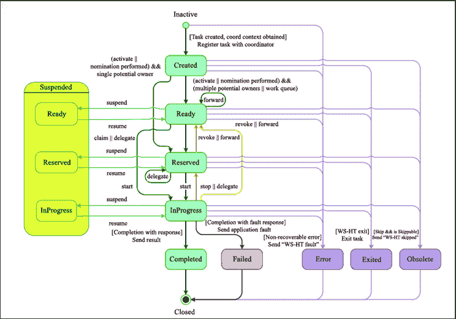

# jBPM 人工任务

> 原文:[https://www.javatpoint.com/jbpm-human-task](https://www.javatpoint.com/jbpm-human-task)

大多数业务流程都需要人工交互。例如，审批、异常管理和一些其他相关操作可能需要人工。他们还负责执行增强业务流程所需的活动。

jBPM 支持流程内部不同类型的人工任务节点，用于建模与人工用户的交互。人工任务节点允许流程设计人员定义人工参与者需要执行的任务属性。jBPM 还包括一个后端服务，在运行时管理任务的生命周期。

为了在流程中使用人工任务，我们需要三个组件-

## 人工任务生命周期

从流程的角度来看，只有在流程执行过程中遇到用户任务节点时，才会创建人工任务。现在，只有当关联的人工任务已经完成或中止时，流程才会离开用户任务节点。

人类的任务本身有一个完整的生命周期。下图描述了人工任务生命周期。

新任务在*“已创建”*阶段开始创建。然后自动进入*“准备”*阶段。“这里”任务显示了允许执行该任务的所有参与者的任务列表。任务将停留在*准备*阶段，直到这些演员中的一个声称任务通知他们正在执行它。

一旦用户声明了任务，状态将变为*“保留”*阶段。在声明任务后，该用户可以决定开始执行任务。在这种情况下，任务状态变为*“正在进行中”*阶段。

最后，任务一旦执行完毕，状态变为*“完成”*。如果任务没有完成，用户也可以使用故障响应来指示这一点。在这种情况下，状态变为*“失败”*。

人工任务服务允许许多其他的生命周期方法，比如-

*   委派或转发任务。在这种情况下，它被分配给另一个演员。
*   撤销任务后，它不再由任何特定的参与者声明，而是重新出现在所有潜在参与者的任务列表中
*   暂时暂停或恢复任务
*   停止正在进行的任务
*   跳过任务。在这种情况下，任务将不会被执行。