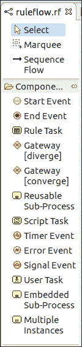
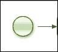
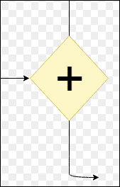
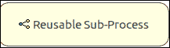
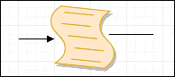
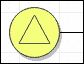
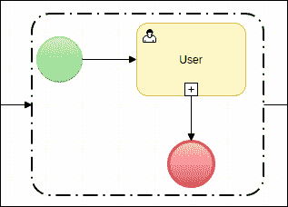

# jBPM 工作流组件

> 原文:[https://www.javatpoint.com/jbpm-workflow-component](https://www.javatpoint.com/jbpm-workflow-component)

## 开始事件

它是流程的起始节点。每个进程只有一个开始节点。此节点只包含一个传出连接，没有任何传入连接。它具有以下属性:

**Id:** 节点的 Id。它也应该是独一无二的。

**名称:**节点的名称。

## 结束事件

它是流程的结束节点。一个流程可以包含多个结束事件。此节点只包含一个传入连接，没有传出连接。它具有以下属性:

**Id:** 节点的 Id。它也应该是独一无二的。

**名称:**节点的名称。

**终止:**终止整个进程或一条路径。

## 规则任务

规则任务创建一组需要在我们的流程中评估的规则。每个规则任务都有一个传入连接和一个传出连接。规则任务是通过在单独的文件中使用 Drools 规则格式来定义的。它具有以下属性:

**Id:** 节点的 Id，并且是唯一的。

**名称:**节点的名称。

**规则流组:**代表规则集。

### 门户[分歧]

它允许我们在这个过程中创造一条新的道路。它包含一个传入连接和两个或多个传出连接。它具有以下属性:

**Id:** 节点的 Id。它也应该是独一无二的。

**名称:**节点的名称。

**类型:**与、异或或或

**约束:**它们链接到每个传出连接。

有三种不同类型的分叉网关节点:

*   **AND:** 该进程的控制流将同时延续到所有的传出连接。
*   **异或:**它只选择一条输出路径。这个决定是由工作流中的一些预定义约束做出的。
*   **或:**它仅从条件评估为真的所有传出连接中选择该路径。

### 网关[汇聚]

它将多条路径同步为一条。只有一个传出连接和两个或更多传入连接。它具有以下属性:

**Id:** 节点的 Id。它也应该是独一无二的。

**名称:**节点的名称。

**类型:**与、异或或或

聚合网关有三种类型:

*   **与:**控制流程在所有进入分支完成后继续，否则等待进入分支完成继续。
*   **异或:**当至少一个输入分支已经完成时，控制流继续。
*   **OR:** 当所有进入分支的直接活动路径都已完成时，控制流程继续。

### 可重用子流程

它从进程内部调用另一个进程。一个子进程有一个传入连接和一个传出连接。它具有以下属性:

**Id:** 节点的 Id。它也应该是独一无二的。

**名称:**节点的名称。

**ProcessId:** 将要执行的进程的 Id。

**等待完成:**默认为真。如果启动的子进程终止执行，子进程将继续。否则，它将在启动子进程后继续。

**独立:**默认为真。在这种情况下，如果子进程的父进程完成，它将不会被终止。只有当“等待完成”设置为真时，它才为假。

**入、出动作:**在节点入、出时执行。

**参数进/出映射:**子流程节点定义变量的进/出映射。

### 编写任务脚本

它是一个执行简单代码的节点。它有一个传入连接和一个传出连接。它具有以下属性:标识、名称和操作。

### 计时器事件

该节点为进程设置计时器。它会在指定的时间段内触发特定的逻辑，或者以固定的时间间隔重复某个动作。

### 错误事件

它用于在进程中引发异常。它只有一个传入连接，没有传出连接。它具有以下属性:标识、名称、故障名和故障变量。

### 信号事件

它用于在流程执行期间响应事件。它有一个传入和一个传出连接。它有以下属性:标识、名称、事件类型、变量名称等。

### 用户任务

它用于创建人工任务，并由人工参与者执行以完成流程活动。它有一个传入连接和一个传出连接。它具有以下属性:标识、名称、任务名称、优先级、活动标识、组标识、内容、进入和退出操作、参数映射、结果映射等。

### 筑堤子过程

它用于在父进程中创建子进程。这对更大的过程非常有用。一个子进程有一个传入和一个传出连接。它具有以下属性:标识、名称和变量。

### 多个实例

它允许我们多次执行流程段的实例，并且至少对集合中的每个元素执行一次。它有一个传入和一个传出连接。它有以下属性:标识、名称、集合表达式、变量名称、集合输出、输出变量名称、完成条件等。