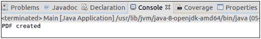

# 创建第一个 PDF 文档

> 原文:[https://www.javatpoint.com/pdfbox-create-first-pdf-document](https://www.javatpoint.com/pdfbox-create-first-pdf-document)

在本节中，我们必须创建一个不包含任何页面的空 PDF 文档。**PDF document**类用于创建 PDF 文档， **save()** 方法用于将文档保存到我们想要的位置。

按照以下步骤创建一个 PDF 文档-

## 创建文档

创建属于包**的 **PDDocument 类**的实例。获取一个 PDDocument 类的实例，我们能够创建一个空的 PDF 文档。**

```java

PDDocument doc = new PDDocument(); 

```

## 保存文档

创建文档后，我们必须将文档保存到我们想要的路径。 **save()** 方法用于保存文档。 **save()** 方法接受一个**字符串值**，并传递文档的路径作为参数。

```java

doc.save("Path of Document");

```

## 关闭文档

完成任务后，我们需要使用 **close()** 方法关闭 PDDocument 类对象。

```java

doc.close();

```

### 示例-

```java

import java.io.IOException; 
import org.apache.pdfbox.pdmodel.PDDocument;

public class Main {

	public static void main(String[] args)throws IOException {
		//Creating PDF document object 
	      PDDocument doc = new PDDocument();    

	//Saving the document
	doc.save("/eclipse-workspace/blank.pdf");

	      System.out.println("PDF created");  

	//Closing the document  
	doc.close();
	}
}

```

**输出:**

成功执行后，程序将显示以下输出消息。



现在，如果我们试图打开这个空的 PDF 文档，它将显示以下错误消息。

