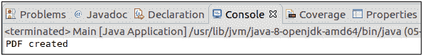
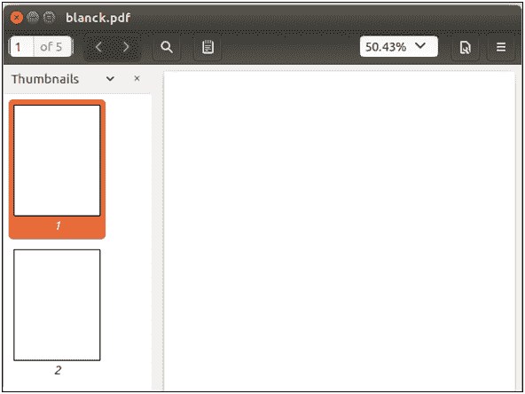

# 添加页面

> 原文:[https://www.javatpoint.com/pdfbox-adding-page](https://www.javatpoint.com/pdfbox-adding-page)

要在 PDF 文档中添加页面，必须要做两件事-


按照以下步骤在 PDF 文档中添加页面-

## 创建文档

创建属于包**的 **PDDocument 类**的实例。得到一个 PDDocument 类的实例，我们能够创建一个空的 PDF 文档。**

```java

PDDocument doc = new PDDocument(); 

```

## 创建空白页

**PDPage** 类用于在 PDF 文档中创建空白页。下面的代码在我们的 PDF 文档中创建页面。

```java

PDPage blankPage = new PDPage();

```

## 添加页面

**addPage ()** 方法用于在 PDF 文档中添加页面。以下代码在我们的 PDF 文档中添加页面。

```java

doc.addPage( blankPage );

```

## 保存文档

创建文档后，我们必须将文档保存到我们想要的位置。 **save()** 方法用于保存文档。 **save()** 方法接受一个**字符串值**，并传递文档的路径作为参数。

```java

doc.save("Path of Document");

```

## 关闭文档

完成任务后，我们需要使用 **close()** 方法关闭 **PDDocument** 类对象。

```java

doc.close();

```

### 示例-

```java

import java.io.IOException; 
import org.apache.pdfbox.pdmodel.PDDocument;
import org.apache.pdfbox.pdmodel.PDPage;

public class Main {

	public static void main(String[] args)throws IOException {
		//Creating PDF document object 
	      PDDocument doc = new PDDocument();    

	for (inti=0; i<5; i++) {
	//Creating a blank page 
	          PDPage blankPage = new PDPage();

	//Adding the blank page to the document
	doc.addPage( blankPage );
	       } 

	//Saving the document
	doc.save("/eclipse-workspace/blank.pdf");

	      System.out.println("PDF created");  

	//Closing the document  
	doc.close();
	}
}

```

**输出:**

成功执行上述程序后，我们将看到以下输出消息。



现在，我们可以在 PDF 文档中看到空白页，如下图所示。

