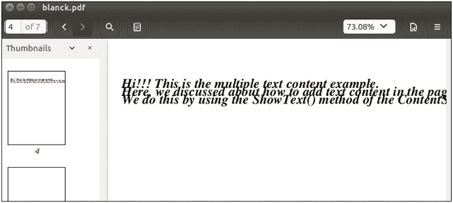

# 阅读文本

> 原文:[https://www.javatpoint.com/pdfbox-reading-text](https://www.javatpoint.com/pdfbox-reading-text)

**PDFBox 库**的一个主要特点是能够快速准确地从现有的 PDF 文档中提取文本。在本节中，我们将学习如何使用 Java 程序从 PDFBox 库中的现有文档中读取文本**。PDF 文档可能包含文本、动画和图像等作为其文本内容。我们可以使用 **PDFTextStripper 类**的 **getText()** 方法从现有的 PDF 文档中提取文本。**

按照以下步骤**从现有的 PDF 文档中读取文本**

## 加载 PDF 文档

我们可以使用静态 **load()** 方法加载现有的 PDF 文档。该方法接受一个**文件对象**作为**参数**。我们也可以使用 **PDFBox** 的类名 **PDDocument** 来调用它。

```java

File file = new File("Path of Document"); 
PDDocument doc = PDDocument.load(file); 

```

## 实例化 PDFTextStripper 类

**PDFTextStripper 类**用于从 **PDF 文档**中检索文本。我们可以将这个类实例化如下-

```java

PDFTextStripper pdfStripper = new PDFTextStripper();

```

## 检索文本

**getText()** 方法用于从 PDF 文档中读取文本内容。在这个方法中，我们需要传递**文档对象**作为参数。该方法将文本作为**字符串对象**返回。

```java

String text = pdfStripper.getText(doc);

```

## 关闭文档

完成任务后，我们需要使用 **close()** 方法关闭 **PDDocument** 类对象。

```java

doc.close();

```

### 示例-

这是一个 PDF 文档，我们将在其中使用一个 Java 程序的 PDFBox 库提取其文本内容。



## Java 程序-

```java

import java.io.File;
import java.io.IOException;

import java.io.File;
import java.io.IOException;

import org.apache.pdfbox.pdmodel.PDDocument;
import org.apache.pdfbox.text.PDFTextStripper;

public class ExtractText {

	public static void main(String[] args)throws IOException {

		//Loading an existing document
	      File file = new File("/eclipse-workspace/blank.pdf");
	      PDDocument doc = PDDocument.load(file);

	//Instantiate PDFTextStripper class
	      PDFTextStripper pdfStripper = new PDFTextStripper();

	//Retrieving text from PDF document
	      String text = pdfStripper.getText(doc);
	      System.out.println("Text in PDF\n---------------------------------");
	      System.out.println(text);

	//Closing the document
	doc.close();
	}
}

```

**输出:**

成功执行后，上述程序从 PDF 文档中检索文本，如下图所示。

