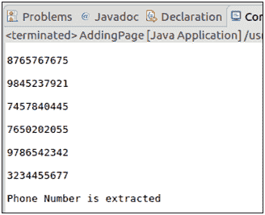

# 提取电话号码

> 原文:[https://www.javatpoint.com/pdfbox-extracting-phone-number](https://www.javatpoint.com/pdfbox-extracting-phone-number)

**PDFBox 库**有多种功能。它能够快速准确地从现有的 PDF 文档中提取电话联系人。在本节中，我们将学习如何使用 Java 程序从 PDFBox 库中的现有文档中读取电话号码**。PDF 文档还可能包含文本、动画和 imagesetc。作为它的内容。**

按照以下步骤从现有的 PDF 文档中提取电话号码-

## 加载 PDF 文档

我们可以使用静态 **load()** 方法加载现有的 PDF 文档。该方法接受一个**文件对象**作为**参数**。我们也可以使用 **PDFBox** 的类名 **PDDocument** 来调用它。

```java
File file = new File("Path of Document"); 
PDDocument doc = PDDocument.load(file); 

```

## 实例化 StringBuilder 和 PDFTextStripper 类

**StringBuilder** 和 **PDFTextStripper 类**用于从 **PDF 文档**中检索文本。我们可以将这些类实例化如下:

```java
StringBuilder sb = new StringBuilder();			
PDFTextStripper stripper = new PDFTextStripper();

```

## 为电话号码设置模式

**模式**是指我们要找的电话号码的格式。在我们的示例中，我们正在寻找带有 10 位数字**的号码，并且在电话号码的两端至少有一个环绕的**空格**。模式可以从以下设置:**

```java
Pattern p = Pattern.compile("\\s\\d\\d\\d\\d\\d\\d\\d\\d\\d\\d\\s");

```

## 检索电话号码

我们可以使用**匹配器**来检索电话号码，匹配器指的是找到模式的实际文本。如果找到电话号码，使用**组()**方法打印电话号码，该方法指的是遵循我们指定的模式的下一个号码。

```java
Matcher m = p.matcher(sb);
while (m.find()){
	    System.out.println(m.group());			
	 }

```

## 关闭文档

完成任务后，我们需要使用 **close()** 方法关闭 **PDDocument 类对象**。

```java
doc.close();

```

### 示例-

这是一份包含**文本**和**电话号码**的 PDF 文档。从这个 PDF 中，我们只想提取电话号码。这里，我们假设电话号码是 **10 位数字**长。我们可以通过 **Java 程序**的 PDFBox 库来做到这一点。


## Java 程序

```java
import java.io.*;
import org.apache.pdfbox.pdmodel.*;
import org.apache.pdfbox.text.PDFTextStripper;
import java.util.regex.*;

public class ExtractPhone {

		public static void main(String[] args)throws IOException {

		// PDF file from the phone numbers are extracted
	         File fileName = new File("/eclipse-workspace/phone.pdf");
		   PDDocument doc = PDDocument.load(fileName);

	// StringBuilder to store the extracted text
		   StringBuilder sb = new StringBuilder();			
		   PDFTextStripper stripper = new PDFTextStripper();

	// Add text to the StringBuilder from the PDF
	sb.append(stripper.getText(doc));

	// Regex-> The Pattern refers to the format you are looking for. In our example,we are looking for 
	//numbers with 10 digits with atleast one surrounding white spaces on both ends.
	       Pattern p = Pattern.compile("\\s\\d\\d\\d\\d\\d\\d\\d\\d\\d\\d\\s");

	// Matcher refers to the actual text where the pattern will be found
	       Matcher m = p.matcher(sb);
	while (m.find()){
	//group() method refers to the next number that follows the pattern we have specified.
			   System.out.println(m.group());			
			   }

			if (doc != null) {
			doc.close();
			   }
			   System.out.println("\nPhone Number is extracted");
		}
}

```

**输出:**

成功执行上述程序后，我们可以看到以下输出。

**