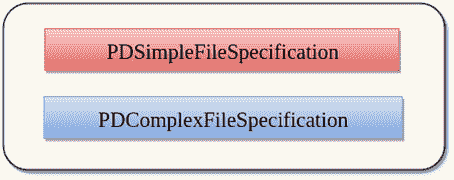
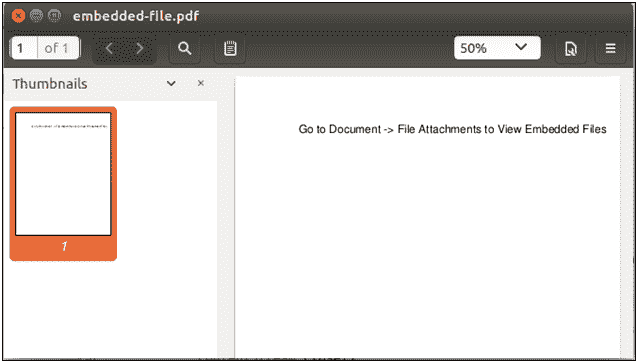

# 处理附件

> 原文：<https://www.javatpoint.com/pdfbox-working-with-attachments>

一个 PDF 文档可以包含通过**文件系统**对外部文件的引用，或者包含到远程位置的**网址**。也可以将**二进制文件嵌入到 PDF 文档中。**

Apache PDFBox 提供了以下**类**，可用于引用文件。



| 班级 | 描述 |
| pdsimplefile specification | 它是对文件的简单字符串引用。pdsimplefile 指定类不允许设置任何参数。 |
| pdcomplexsiles 规范 | 它是一个功能更丰富的类，允许对文件进行高级设置引用。 |

在 PDFBox 中，也可以将文件直接嵌入到 PDF 文档中。这可以通过使用**嵌入文件**属性来执行，而不是设置**pdcomplexsilespecification**类的文件属性。

## 将文件嵌入到 PDF 文档

PDF 文档可以包含文件附件。文件附件可从 ***文档- >文件附件*** 菜单中访问。PDFBox 允许我们在 PDF 文档中添加附件，也可以从 PDF 文档中提取附件。在 PDFBox 中，附件是附加到文档目录的命名树的一部分。

以下是向 PDF 文件添加附件的分步过程。

### 加载现有文档

我们可以使用静态 **load ()** 方法加载现有的 PDF 文档。该方法接受一个**文件对象**作为**参数**。我们也可以使用 PDFBox 的类名 **PDDocument** 来调用它。

```java
File file = new File("PATH"); 
PDDocument doc = PDDocument.load(file); 

```

### 实例化 PDDocumentNameDictionary

在这种情况下，附件作为“名称”字典的一部分存储在文档目录中。

```java
PDDocumentNameDictionary names = new DdocumentNameDictionary (doc.getDocumentCatalog());

```

### 检索现有附件并添加新附件

```java
PDEmbeddedFilesNameTreeNode efTree = names.getEmbeddedFiles();
 Map existedNames = efTree.getNames();

```

### 创建保存嵌入文件的文件规范

```java
PDComplexFileSpecification fs = new PDComplexFileSpecification();
        fs.setFile( "Test.txt" );
        InputStream is = ...;
        PDEmbeddedFile ef = new PDEmbeddedFile(doc, is );

```

### 示例-

```java
import org.apache.pdfbox.pdmodel.*;
import org.apache.pdfbox.pdmodel.common.filespecification.PDComplexFileSpecification;
import org.apache.pdfbox.pdmodel.common.filespecification.PDEmbeddedFile;
import org.apache.pdfbox.pdmodel.font.PDType1Font;
import java.io.ByteArrayInputStream;
import java.io.File;
import java.io.IOException;
import java.util.*;

public class AddingAttachments {
	public static void main(String[] args)throws IOException {

		try (final PDDocument doc = new PDDocument()){

            PDPage page = new PDPage();
doc.addPage(page);

          PDPageContentStream contentStream = new PDPageContentStream(doc, page);

contentStream.beginText();
contentStream.setFont(PDType1Font.HELVETICA, 12);
contentStream.newLineAtOffset(100, 700);
contentStream.showText("Go to Document -> File Attachments to View Embedded Files");
contentStream.endText();
contentStream.close();

// embedded files are stored in a named tree
            PDEmbeddedFilesNameTreeNode efTree = new PDEmbeddedFilesNameTreeNode();

// first create the file specification, which holds the embedded file
            PDComplexFileSpecification fs = new PDComplexFileSpecification();
fs.setFile("example-document.txt");

// create a dummy file stream, this would probably normally be a FileInputStream
byte[] data = "This is the contents of the embedded file".getBytes("ISO-8859-1");
            ByteArrayInputStream fakeFile = new ByteArrayInputStream(data);

// now lets some of the optional parameters
            PDEmbeddedFile ef = new PDEmbeddedFile(doc, fakeFile);
ef.setSubtype("text/plain");
ef.setSize(data.length);
ef.setCreationDate(Calendar.getInstance());
fs.setEmbeddedFile(ef);

// create a new tree node and add the embedded file 
            PDEmbeddedFilesNameTreeNode treeNode = new PDEmbeddedFilesNameTreeNode();
treeNode.setNames(Collections.singletonMap("My first attachment",  fs));

// add the new node as kid to the root node
            List<PDEmbeddedFilesNameTreeNode>kids = new ArrayList<PDEmbeddedFilesNameTreeNode>();
kids.add(treeNode);
efTree.setKids(kids);

// add the tree to the document catalog
            PDDocumentNameDictionary names = new PDDocumentNameDictionary(doc.getDocumentCatalog());
names.setEmbeddedFiles(efTree);
doc.getDocumentCatalog().setNames(names);

doc.save(new File("/eclipse-workspace/embedded-file.pdf"));
            System.out.println("Embaded PDF file is created");
        } catch (IOException e){
       System.err.println("Exception while trying to create pdf document - " + e);
      }
   }
}

```

**输出:**

