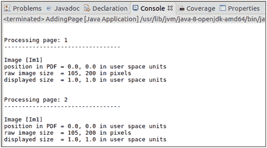

# 获取图像的位置和大小

> 原文:[https://www . javatpoint . com/pdfbox-get-location-image-size](https://www.javatpoint.com/pdfbox-get-location-and-image-size)

在本教程中，我们将学习如何从所有页面获取 PDF 格式的图像坐标或位置和大小。这可以通过使用**pdfsstreamengine**类来执行。这个类通过提供回调接口来处理和执行处理 PDF 文档的操作。

为了得到 PDF 文档中图像的位置和大小，我们将扩展**pdfsstreamengine**类，截取并实现 **processOperator()** 方法。

对于 PDF 文档中的每个对象，我们将检查该对象是否是图像对象，并获取其属性，如(X，Y)坐标和大小。为此，我们可以使用**中调用的 **processOperator()** 方法。**

按照以下步骤获取现有 PDF 文档中图像的坐标或位置和大小-

## 扩展 PDFStreamEngine

在这种情况下，我们必须首先创建一个 **Java 类**，并使用**pdfsstreamengine**对其进行扩展。这可以在下面的代码中显示。

```java

publicclass GetImageLocationsAndSize extends PDFStreamEngine {

......

} 

```

## 调用 processPage()

对于 PDF 文档中的每个页面，调用方法 **processPage()** 。此方法接受页面名称作为参数。它可以在下面的代码中显示。

```java

for( PDPage page : document.getPages() )
	            {
	pageNum++;
	printer.processPage(page);
	            }

```

## 覆盖 processOperator()

对于 PDF 页面中的每个对象，在 **processPage()** 方法中调用 **processOperator** 。我们也可以覆盖 **processOperator()** 方法。

```java

@Override
protectedvoid processOperator( Operator operator, List<COSBase>operands)
 throws IOException { 

...........

}

```

## 检查图像

现在，我们可以检查已经发送到 **processOperator()** 方法的对象是否是图像对象。

```java

if( xobjectinstanceof PDImageXObject)
	        {
	            PDImageXObject image = (PDImageXObject)xobject;
	intimageWidth = image.getWidth();
	intimageHeight = image.getHeight();                
	            System.out.println("\nImage [" + objectName.getName() + "]");
              }

```

## 打印位置和尺寸

最后，如果给定对象是图像对象，则打印图像的**位置**和**大小**。

```java

             // position of image in the PDF in terms of user space units
	          System.out.println("Position in PDF = " + ctmNew.getTranslateX() + ",
			  " + ctmNew.getTranslateY() + " in user space units");

// raw size in pixels
	          System.out.println("Raw image size  = " + imageWidth + ",
			  " + imageHeight + " in pixels");

	// displayed size in user space units
	          System.out.println("Displayed size  = " + imageXScale + ",
			  " + imageYScale + " in user space units");

```

### 示例-

```java

import org.apache.pdfbox.cos.COSBase;
import org.apache.pdfbox.cos.COSName;
import org.apache.pdfbox.pdmodel.PDDocument;
import org.apache.pdfbox.pdmodel.PDPage;
import org.apache.pdfbox.pdmodel.graphics.PDXObject;
import org.apache.pdfbox.pdmodel.graphics.form.PDFormXObject;
import org.apache.pdfbox.pdmodel.graphics.image.PDImageXObject;
import org.apache.pdfbox.util.Matrix;
import org.apache.pdfbox.contentstream.operator.DrawObject;
import org.apache.pdfbox.contentstream.operator.Operator;
import org.apache.pdfbox.contentstream.PDFStreamEngine;

import java.io.File;
import java.io.IOException;
import java.util.List;

import org.apache.pdfbox.contentstream.operator.state.Concatenate;
import org.apache.pdfbox.contentstream.operator.state.Restore;
import org.apache.pdfbox.contentstream.operator.state.Save;
import org.apache.pdfbox.contentstream.operator.state.SetGraphicsStateParameters;
import org.apache.pdfbox.contentstream.operator.state.SetMatrix;

public class GetImageLocationsAndSize extends PDFStreamEngine {	

public void GetImageLocationsAndSize() throws IOException
    {
// preparing PDFStreamEngine
        addOperator(new Concatenate());
        addOperator(new DrawObject());
        addOperator(new SetGraphicsStateParameters());
        addOperator(new Save());
        addOperator(new Restore());
        addOperator(new SetMatrix());
    }	
		publicstaticvoid main(String[] args)throws IOException {

		PDDocument document = null;
	      String fileName = "/eclipse-workspace/Merge.pdf";
	try
	      {
	document = PDDocument.load( new File(fileName) );
	         GetImageLocationsAndSize printer = new GetImageLocationsAndSize();
	intpageNum = 0;
	for( PDPage page : document.getPages() )
	            {
	pageNum++;
	                System.out.println( "\n\nProcessing PDF page:
					" + pageNum +"\n---------------------------------");
	printer.processPage(page);
	            }
	        }
	finally
	        {
	if( document != null )
	            {
	document.close();
	            }
	        }
	    }

	protectedvoid processOperator( Operator operator, List<COSBase>operands)
	throws IOException
	    {
	        String operation = operator.getName();
	if( "Do".equals(operation) )
	        {
	            COSName objectName = (COSName) operands.get( 0 );
	// get the PDF object
	            PDXObject xobject = getResources().getXObject( objectName );

	// check if the object is an image object
	if( xobjectinstanceof PDImageXObject)
	            {
	                PDImageXObject image = (PDImageXObject)xobject;
	intimageWidth = image.getWidth();
	intimageHeight = image.getHeight();

	              System.out.println("\nImage [" + objectName.getName() + "]");

	       Matrix ctmNew = getGraphicsState().getCurrentTransformationMatrix();
	floatimageXScale = ctmNew.getScalingFactorX();
	floatimageYScale = ctmNew.getScalingFactorY();

	// position of image in the PDF in terms of user space units
	           System.out.println("position in PDF = " + ctmNew.getTranslateX() + ",
			   " + ctmNew.getTranslateY() + " in user space units");

// raw size in pixels
	           System.out.println("raw image size  = " + imageWidth + ",
			   " + imageHeight + " in pixels");

	// displayed size in user space units
	           System.out.println("displayed size  = " + imageXScale + ",
			   " + imageYScale + " in user space units");

	            }
	elseif(xobjectinstanceof PDFormXObject)
	            {
	                PDFormXObject form = (PDFormXObject)xobject;
	                showForm(form);
	            }
	        }
	else
	        {
	super.processOperator( operator, operands );
	        }
	 }
}

```

**输出:**

