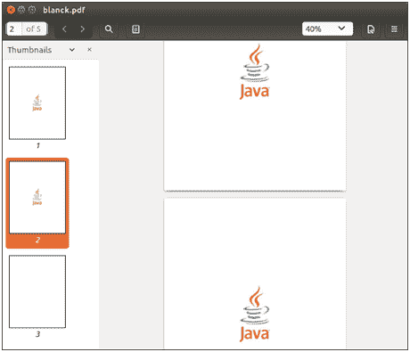
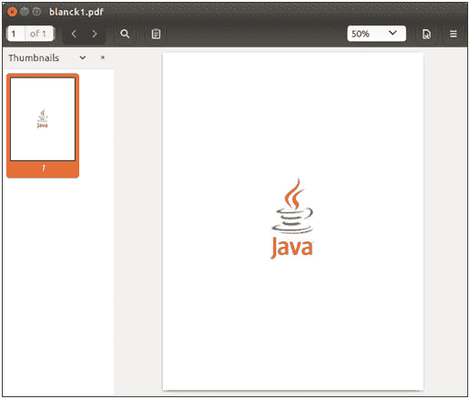

# 分割 PDF 文档

> 原文:[https://www.javatpoint.com/pdfbox-splitting-pdf-document](https://www.javatpoint.com/pdfbox-splitting-pdf-document)

我们可以将给定的 PDF 文档拆分成多个 PDF 文件。**拆分器**类可以将每个 PDF 文件拆分成一个单独的文件。此类用于将给定的 PDF 文档拆分成其他几个单独的文档。

要**分割**现有的 PDF 文件，请执行以下操作-

## 加载现有文档

我们可以使用静态 **load()** 方法加载现有的 PDF 文档。该方法接受一个**文件对象**作为**参数**。我们也可以使用 PDFBox 的类名 **PDDocument** 来调用它。

```java

File file = new File("PATH"); 
PDDocument doc = PDDocument.load(file); 

```

## 创建拆分器对象

**拆分器**类用于拆分现有的 PDF 文档。我们可以如下实例化拆分器类。

```java

Splitter splitter = new Splitter();

```

## 拆分 PDF 文档

我们可以使用**拆分器**类的**拆分()**方法来拆分现有的 PDF 文档。 **split()** 方法接受 **PDDocument** 类的对象作为参数。

```java

List<PDDocument>Pages = splitter.split(document);

```

## 创建迭代器对象

可以使用 **listIterator()** 方法获取迭代器对象。这个**迭代器**对象用来遍历我们需要的文档列表。以下代码创建**迭代器**对象。

```java

Iterator<PDDocument>iterator = Pages.listIterator();

```

## 关闭文档

完成任务后，我们需要使用 **close()** 方法关闭 **PDDocument 类对象**。

```java

doc.close();

```

### 示例-

这是一个包含五页的 PDF 文档。前两页包含图像。我们将拆分这两个页面，这两个页面通过一个 Java 程序以单个文件的形式包含图像。



## Java 程序

```java

import org.apache.pdfbox.multipdf.Splitter; 
import org.apache.pdfbox.pdmodel.PDDocument;
import java.io.File; 
import java.io.IOException; 
import java.util.List; 
import java.util.Iterator;

public class SplitsPdfDemo {

	public static void main(String[] args)throws IOException {

		//Loading an existing PDF document
	      File file = new File("//eclipse-workspace/blanck.pdf");
	      PDDocument document = PDDocument.load(file); 

	// Create a Splitter object
	      Splitter splitter = new Splitter();

	//splitting the pages of a PDF document
	      List<PDDocument>Pages = splitter.split(document);

	//Creating an iterator object
	      Iterator<PDDocument>iterator = Pages.listIterator();

	//saving splits as individual PDF document
	inti = 1;
	while(iterator.hasNext()) {
	         PDDocument pd = iterator.next();
	pd.save("/eclipse-workspace/blanck"+ i++ +".pdf");
	      }
	      System.out.println("Multiple PDF files are created successfully.");
	document.close();
	}
}

```

**输出:**

成功执行上述程序后，我们可以看到以下输出。


现在进行验证，单独打开 PDF 文件，如下图-


