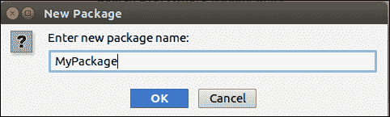
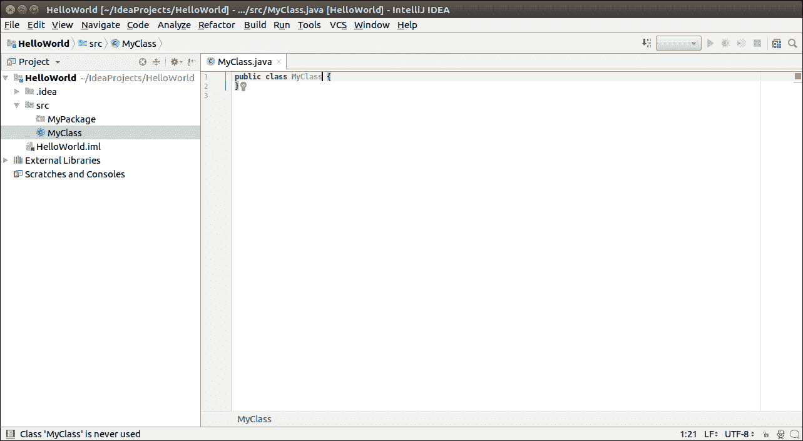

# 第一个 Java 程序

> 原文:[https://www.javatpoint.com/intellij-idea-first-java-program](https://www.javatpoint.com/intellij-idea-first-java-program)

在这里，我们将创建我们的第一个 Java 项目。我们将编写并执行**你好世界**程序。

## 1.创建项目

启动 **IntelliJ IDE** 。前往**文件** - > **新建** - > **项目**。出现以下屏幕。


选择 **Java 项目**和合适的**项目软件开发工具包**。点击**下一步**。

现在，输入**项目名称**，选择**项目位置**。点击**完成**。


一旦我们点击**完成**按钮，将打开以下屏幕。


## 2.创建包

转到**项目结构**，右键 **src** - > **新建** - > **包**。输入**包装名称**，点击**确定**按钮。



## 3.创建 Java 类

转到**项目结构**，右键 **src** - > **新建** - > **Java 类**。创建**新类名**，点击**确定**按钮。


一旦我们点击**确定**按钮，带有**类声明**的**编辑器窗口**将会打开。这里我们编写我们想要运行和执行的代码。



## 4.运行应用程序

在**编辑器窗口**中输入以下**代码**，该窗口将在**控制台**上打印**输出**。

```java

public class MyClass {
    public static void main(String[] args) {
        System.out.println("Hello World !!");
    }
}

```

进入**运行菜单**，选择**运行选项**。

再次选择**类名**运行。**输出**将出现在**控制台**上。

