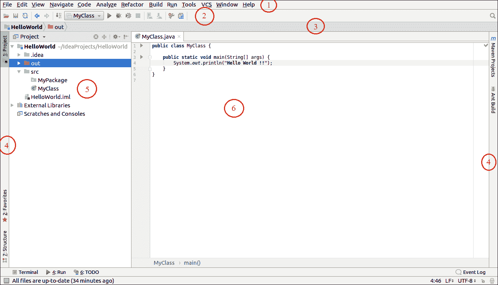

# 智能窗口元素

> 原文:[https://www.javatpoint.com/intellij-idea-window-elements](https://www.javatpoint.com/intellij-idea-window-elements)

为了提高智能集成开发环境的性能，我们需要理解和识别编辑器主窗口中的视觉元素。下面的截图显示了智能编辑器主窗口。

主窗口可以分为以下几个部分:

### 1.酒吧菜单

主菜单栏提供了一个选项，我们可以使用它来完成创建新项目、管理文件、重构代码、构建、运行、调试等任务。

### 2.工具栏

工具栏包含快捷选项，可以执行编译、调试、运行等操作。我们也可以根据需要定制这个工具栏。

### 3.导航栏

这个栏是一个快速而好的选择，可以轻松快速地浏览项目文件。

### 4.工具标签

它显示在屏幕的两侧和智能集成开发环境的底部。在这里，我们可以直接访问一些工具，比如数据库、Maven 项目、Ant Builds 等等。

### 5.项目结构

它显示了项目的各种元素，如包、类、模块、工作空间、库等。

### 6.编辑器窗口

编辑器是我们可以编写代码的地方。在这里，开发人员花了大部分时间根据项目的要求开发代码。

### 7.状态栏

状态栏显示关于当前打开文件和当前项目状态的信息。它还提供了关于最近项目汇编的信息。我们可以在编辑器窗口的底部显示状态栏。