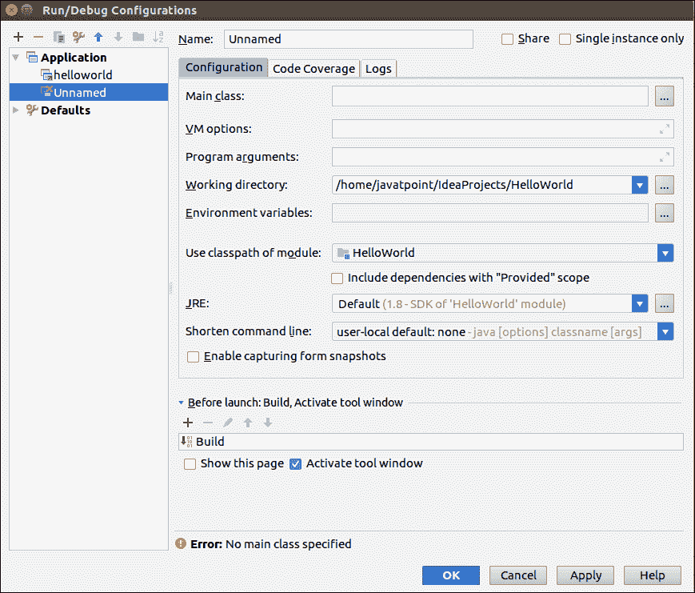

# 运行项目的智能想法

> 原文:[https://www.javatpoint.com/intellij-idea-running-projects](https://www.javatpoint.com/intellij-idea-running-projects)

IntelliJ IDEA 有很多方法可以为正在运行的项目创建配置。配置选项包括:

1.  创建临时配置
2.  创建永久配置
3.  在用户之间共享配置

## 创建临时配置

1.  创建**项目**
2.  创建 **Java 类**
3.  右键单击并选择**运行**选项
4.  运行菜单上添加了临时配置。

## 创建永久配置

当我们用 IntelliJ 保存临时配置时，它可以转换为永久配置。要保存此配置，请单击运行菜单上的保存配置。我们也可以根据自己的需求编辑这个配置。

## 创建新配置

我们还可以选择创建新的配置。要创建新配置，请执行以下操作:

1.  转到**运行- >编辑配置**
2.  点击**绿色加**按钮。将打开新的配置选项
3.  从下拉列表中选择**应用程序**。根据我们的要求进行配置。
4.  点击**确定**按钮。

## 共享配置

要共享配置，请执行以下操作:

1.  转到**运行- >编辑配置**
2.  选择**配置**选项卡。填写详细信息，点击配置窗口右上角的**共享复选框**。
3.  现在我们的配置将存储在**盘**上。
4.  配置文件将与**一起存储。ipr 文件**扩展名。

