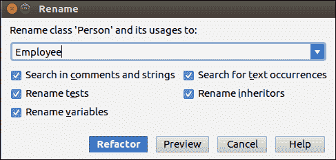
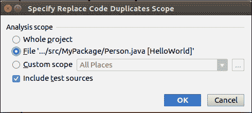

# 智能代码重构

> 原文：<https://www.javatpoint.com/intellij-idea-code-refactoring>

重构是改变现有程序的结构而不改变其功能和用途的过程。重构还用于提高代码的可重用性，提高性能，并删除重复的功能或未使用的功能。重构是一项应该非常小心地执行的任务，因为一个简单的错误就可能产生大量的错误。

在重构菜单中，我们可以找到所有可能的重构选项。重构还有一个快捷选项。**“Ctrl+Alt+Shift+T”**快捷方式将打开一个弹出窗口，其中显示了光标所在代码段的所有可用重构选项。

一些重要的重构选项如下:

*   重新命名
*   复制重构
*   移动重构
*   安全删除
*   查找和替换代码副本

## 重新命名

此操作提供了重命名方法、属性、参数等的工具。在这里，我们将创建一个类名为 Person 的示例。

```java

public class Person {
    private String name;
    private String address;
    private int age;
    public Person() {
        this("PeterJohn", 30);
    }
    public Person(String name, int age) {
        this.name = name;
        this.age = age;
    }
    public String getName() {
        return name;
    }
    public void setName(String name) {
        this.name = name;
    }
    public int getAge() {
        return age;
    }
    public void setAge(int age) {
        this.age = age;
    }
    @Override
    public String toString() {
        return "Person{" +
                "name='" + name + '\'' +
                ", age=" + age +
                '}';
    }
    public static void main(String args[]) {
        Person e = new Person();
        System.out.println(e);
    }
}

```

现在我们用**员工**更改**人**类的名称，然后修改**构造函数**和 **main()** 方法。为此，请遵循以下步骤:

*   选择人物词
*   在菜单栏中，转到重构->重命名。出现以下屏幕。更改名称，然后单击重构按钮。



## 复制重构

此操作用于将一个类复制到另一个类。它可以在现有的或新的中完成。为此，请遵循以下步骤:

*   转到重构->复制。屏幕下方出现。


*   进入**新名称**，选择**目的地套餐****点击确定**按钮。

## 移动重构

它为我们提供了将文件移动到另一个地方或创建另一个类的内部类的工具。为此，请遵循以下步骤:

*   转到**重构- >移动**。屏幕下方出现。
*   提供目的地。点击**重构**。


## 安全删除

该选项将删除对象、类、方法、接口、参数等。仅当项目中的任何地方都没有引用它时。为此，请遵循以下步骤:

在编辑器中键入以下代码，然后选择“sayHi”

```java

package MyPackage;
public class HelloWorld {
    static void sayHi(){
        System.out.println("Hi");
    }
    public static void main(String[] args) {
        sayHi();
    }
}

```

现在转到**重构- >安全删除**

如果在任何地方使用 **sayHi** 方法，它将显示在下面的屏幕上。


## 查找和替换代码副本

此重构选项标识与所选方法或常量字段相似的重复代码，并用合适的代码替换它。为此，请遵循以下步骤:

*   输入下面的代码，定位**光标**，我们要搜索它的副本。

```java

package MyPackage;
public class Person {
    private String name;
    private int age;
    public Person() {
        this("PeterJohn", 40);
    }
    public Person(String name, int age) {
        this.name = name;

        this.age = age;
    }
    public void setData(String name, int age) {
        this.name = name;
        this.age = age;
    }
    public void showPersonDetail() {
        System.out.println("Name = " + name + ", Age = " + age);
    }
    public static void main(String args[]) {
        Person e = new Person();
        e.showPersonDetail();
    }
}

```

*   转到**重构- >查找并替换代码副本**
*   对话框打开，选择 IDE 将在其中查找重复项的范围



*   重构后给出确认信息，点击**重构**。输出为:

```java

package MyPackage;
public class Person {
    private String name;
    private int age;
    public Person() {
        this("PeterJohn", 40);
    }
    public Person(String name, int age) {
        setData(name, age);
    }
    public void setData(String name, int age) {
        this.name = name;
        this.age = age;
    }
    public void showPersonDetail() {
        System.out.println("Name = " + name + ", Age = " + age);
    }
    public static void main(String args[]) {
        Person e = new Person();
        e.showPersonDetail();
    }
}

```