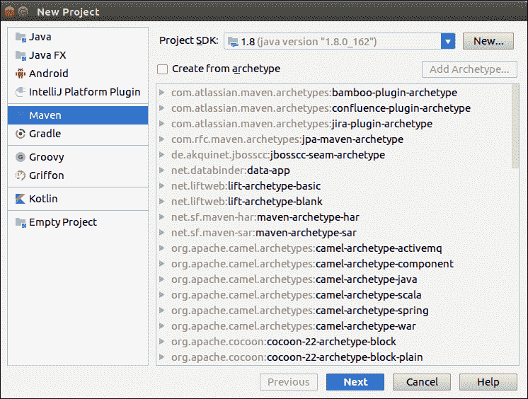
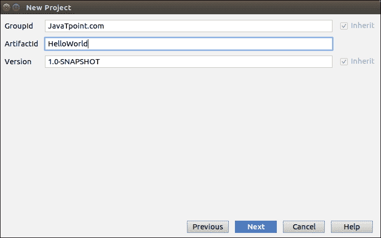
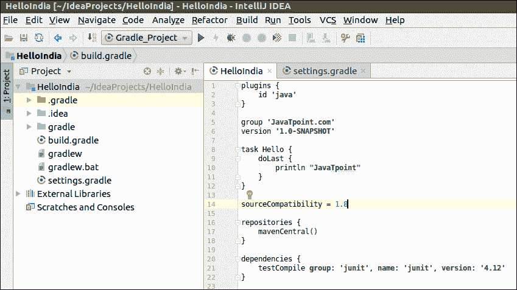

# 智能创意构建工具

> 原文:[https://www.javatpoint.com/intellij-idea-build-tool](https://www.javatpoint.com/intellij-idea-build-tool)

IntelliJ IDEA 提供了一个构建工具选项，可以根据我们的源代码自动创建可执行的应用程序。它提供了将 Java 代码编译、链接和打包成可执行形式的工具。

IntelliJ IDEA 支持针对 java 应用的各种 Build Tools，如 Maven、Gradle、Ant 等。在本节中，我们将讨论 Maven 和 Gradle 构建工具。

## 创建 Maven 项目

要创建 Maven 项目，请执行以下操作:

1.转到**文件- >新建- >项目**。新的窗口屏幕打开。

2.在左窗格中选择 **Maven** ，点击**下一步**按钮。



3.新的窗口屏幕将会打开。键入**组号**和**人工号**。点击**下一步**。



4.点击**完成**。它将打开 **pom.xml** 文件。

5.在这个文件中，我们将**添加属性**。最终 **pom.xml** 文件看起来是这样的。

```java

<?xml version="1.0" encoding="UTF-8"?>
<project 
         xmlns:xsi="http://www.w3.org/2001/XMLSchema-instance"
         xsi:schemaLocation="http://maven.apache.org/POM/4.0.0 http://maven.apache.org/xsd/maven-4.0.0.xsd">
    <modelVersion>4.0.0</modelVersion>
    <groupId>JavaTpoint.com</groupId>
    <artifactId>HelloWorld</artifactId>
    <version>1.0-SNAPSHOT</version>
    <properties>
        <maven.compiler.source>1.7</maven.compiler.source>
        <maven.compiler.target>1.7</maven.compiler.target>
    </properties>
</project>

```

6.创建 **Java 类**。

*   转到 **src/main/java**
*   右键选择**新建- > Java 类**。

7.使用 **Maven** 编译 **Java 类**

*   转到**运行- >编辑配置**
*   点击**绿色加号图标**，选择**蓝色**选项。一个新的窗口将会打开。


*   在命令行中输入项目名称和包。
*   单击确定按钮。
*   再次转到运行并选择 Maven_Project 选项。
*   开始构建包。一旦成功构建，我们将看到结果。


## 创建梯度项目

要创建梯度项目，请执行以下操作:

1.转到**文件- >新建- >项目**。新的窗口屏幕打开。

2.在左窗格中选择**渐变**，点击**下一步**按钮。


3.新窗口将会打开。输入**组号**和**人工号**。点击**下一步**。

4.点击**完成**。

5.现在**开始项目**。打开**build . grade**文件，输入下面的代码。



6.使用**梯度**编译**项目**

*   转到**运行- >编辑配置**
*   点击**绿色加号图标**，选择**渐变**选项。一个新的窗口将会打开
*   进入**项目名称**和**任务**。
*   点击**确定**按钮。


再次转到**运行**并选择**梯度 _ 项目**选项。

开始构建包。一旦成功构建，我们将看到结果。

