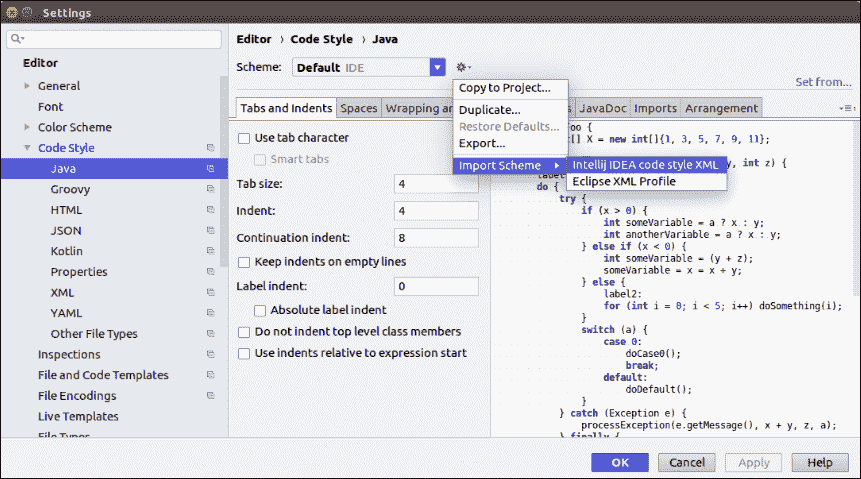
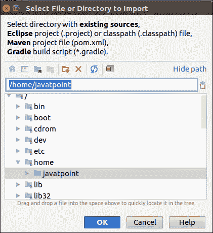

# 从 Eclipse 迁移的智能想法

> 原文:[https://www . javatpoint . com/intellij-idea-migrating-from-eclipse](https://www.javatpoint.com/intellij-idea-migrating-from-eclipse)

Eclipse 是一个受 Java 开发人员欢迎的集成开发环境。如果当前的 Eclipse 用户想要从 eclipse IDE 切换到 IntelliJ IDE，那么就需要了解这两个 IDE 之间的一些基本区别。这些基本差异包括用户界面、术语、项目配置、流行快捷方式和一些其他方面。

## 用户界面

**1。无工作区-** 在 IntelliJ IDEA 中，我们一次只能处理一个项目，但是在 Eclipse 中，我们可以同时处理一组项目。

**2。无视角-** 意味着，我们不能手动切换不同的工作空间布局来执行不同的任务。

**3。多个窗口-** 在 IntelliJ IDEA 中，我们不能用单个项目打开多个窗口，但是我们可以将任意数量的编辑器选项卡打开到单独的窗口中。

## Eclipse 与 IntelliJ 术语

下表比较了 Eclipse 和 IntelliJ IDEA 术语-

| 塞内加尔 | 黯然失色 | IntelliJ IDEA |
| one | 工作空间 | 项目 |
| Two | 项目 | 组件 |
| three | 方面 | 方面 |
| four | 图书馆 | 图书馆 |
| five | 类路径变量 | 路径变量 |
| six | Java 运行时环境 | 软件开发工具包(Software Development Kit) |

## 快捷指令

IntelliJ IDEA 快捷方式不同于 Eclipse 快捷方式。下表给出了一些流行的快捷方式。

| 黯然失色 | IntelliJ IDEA |
| **动作** | **快捷方式** | **动作** | **快捷方式** |
| 奔跑 | Ctrl + Shift + F11 | 奔跑 | Shift + F11 |
| 调试 | 控制 + F11 | 调试 | Shift + F9 |
| 重新命名 | 控制 + Alt + R | 重新命名 | Shift + F6 |
| 搜索 | Ctrl + Shift + K | 搜索 | Ctrl + Shift + F |
| 转到行 | Ctrl + L | 转到行 | 控制 + G |
| 格式 | Ctrl + Shift + F | 格式 | Ctrl + Alt + L |
| 移动线 | Alt +向上/向下 | 移动线 | Shift + Alt +向上/向下 |
| 删除行 | Ctrl + D | 删除行 | Ctrl + Y |
| 上次编辑位置 | 控制 + Q | 上次编辑位置 | Ctrl + Shift +退格 |
| 下一个编辑器 | 控制 + F6 | 下一个编辑器 | Alt + Right |
| 查找下一个 | 控制 + J | 查找下一个 | 第三子代 |
| 向前 | 控制 + J | 向前 | Ctrl + Alt +右 |
| 代码完成 | Ctrl +空格 | 代码完成 | Ctrl +空格 |

## Eclipse Keymap

IntelliJ IDEA 提供了一个与其快捷方式密切相关的 Eclipse 键图。要打开 Eclipse 键盘映射，请执行以下操作:

1.转到**文件- >设置- >键盘映射选项**

2.从**键图下拉菜单**中选择**日食**。

## 代码格式

IntelliJ IDEA 代码格式化规则与 Eclipse 集成开发环境大致相似，只是有一些细微的区别。要导入 Eclipse 代码格式化程序设置，请执行以下操作:

1.转到**文件- >设置- >编辑器- >代码样式- > Java**

2.选择**导入方案- > Eclipse XML 配置文件**

## 排除故障

IntelliJ IDEA 和 Eclipse 调试器类似，但它们使用不同的快捷方式。下表给出了一些调试器快捷方式:

| 黯然失色 | IntelliJ IDEA |
| **动作** | **快捷方式** | **动作** | **快捷方式** |
| 进入 | F5 | 进入 | F7 |
| 跨过 | F6 | 跨过 | F8 |
| 走出去 | F7 | 走出去 | Shift + F8 |
| 简历 | F8 | 简历 | F9 |
| 切换断点 | Ctrl + Shift + B | 切换断点 | 控制 + F8 |

## 将 Eclipse 项目导入 IntelliJ IDEA

按照下面给出的步骤在 IntelliJ IDEA 中导入 Eclipse 项目:

1.从现有来源转到**文件- >新建- >项目**

2.选择 **Eclipse 项目目录**

3.导入**项目向导**打开。选择**从现有来源创建项目**。

4.按照屏幕上的说明继续。

5.结束